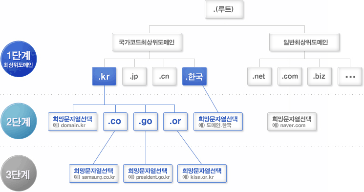

## DNS란?

DNS란 Domain Name System의 약자이다. 그렇다면 Domain은 무엇일까?

DNS에 대해 자세히 알아보기 전에 도메인이 무엇인지에 대해 알아보도록 하자.

## 도메인 (Domain)

인터넷에 연결되어 있는 장치들은 각각의 장치를 식별할 수 있는 주소를 가지고 있는데 이를 `ip주소`라고 한다.

ip주소는 111.22.33.44 와 같은 숫자형식으로 되어 있는데 이는 사람이 기억하기 매우 어렵다. 이러한 어려움에 따라 도메인이 등장하게 되었는데 도메인은 바로 이러한 숫자들을 우리가 기억하기 쉽게 이름을 부여하는 것을 말한다. 예를들면, www.naver.com이 바로 도메인이다.

그렇다면 도메인 이름을 관리하는 것이 DNS일텐데 도대체 DNS는 어떻게 운영되며 관리되고 있을까?

## DNS에 대해 자세히 들여다 보기

DNS는 일반적으로 전 세계 분산형 데이터 베이스 구조로 동작한다. DNS 는 흔히 전화번호부에 비유되는데 이는 `트리 형태`로 구성이 되어 있다. 크게 3단계로 구성되어 있는데 아래 그림과 같이 트리의 형태를 띄는 것을 볼 수 있다.

위와 같은 체계를 갖고 지정된 네임서버로 접속하여 질의 과정을 거치게 되는데 이 과정은 아래와 같다.

1. 웹 브라우저에 www.naver.com을 입력하게 되면 먼저 local DNS에게 www.naver.com이라는 hostname에 대한 ip주소를 묻는다.
2. 만약 local에 없다면 root dns에게 물어본다.
3. root dns가 없다면 root dns는 com dns로 응답한다.
4. com dns에게 www.naver.com 주소가 있는지 묻는다.
5. com dns가 주소가 없다면 naver.com의 ip주소로 응답한다.
6. naver.com에게 www.naver.com 주소를 묻는다.
7. naver.com은 ip 주소 222.122.195.6으로 ip주소를 local dns서버에게 전달한다.
8. 마지막으로, local DNS는 www.naver.com에 대한 ip 주소를 캐싱하고 ip 주소 정보를 전달한다.

이와 같은 재귀적으로 질의를 통해 ip주소를 찾는 과정을 `Recursive Query` 라고 한다. (Root DNS 서버 -> com DNS 서버 -> naver.com DNS 서버)

좀더 자세하게 알고 싶다면 아래의 DNS 구성요소 및 동작원리 동영상과 뒤에 있는 시리즈 까지 보는 것을 추천한다.

<iframe width="560" height="315" src="https://www.youtube.com/embed/fINh76spaiI" title="YouTube video player" frameborder="0" allow="accelerometer; autoplay; clipboard-write; encrypted-media; gyroscope; picture-in-picture" allowfullscreen></iframe>

## 참고

- [도메인 네임 시스템 - 위키백과](https://ko.wikipedia.org/wiki/%EB%8F%84%EB%A9%94%EC%9D%B8_%EB%84%A4%EC%9E%84_%EC%8B%9C%EC%8A%A4%ED%85%9C)
- [도메인 - 생활코딩](https://opentutorials.org/course/228/1450)
- [DNS - 한국 인터넷 정보센터](https://xn--3e0bx5euxnjje69i70af08bea817g.xn--3e0b707e/jsp/resources/dns/dnsInfo.jsp)
- [DNS구성요소 및 동작원리 - 유튜브](https://www.youtube.com/watch?v=fINh76spaiI)
- [DNS 동작원리 - 한량 개발자](https://ijbgo.tistory.com/27)
