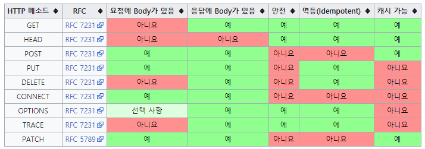

## HTTP 메소드란

HTTP 메소드는 `클라이언트가 웹 서버에게 사용자 요청의 목적이나 종류를 알리는 수단`이다. 최초의 HTTP에서는 GET 메소드 하나밖에 없었지만 이후 다양한 메소드들이 생겨났다.

## HTTP 메소드 종류와 특징

HTTP 메소드의 종류는 총 9가지가 있다. 이 중 주로 쓰이는 메소드는 5가지가 있다. 이제 각각의 이름과 특징에 대해 알아보도록 하자.

주요 메소드 5가지

- GET : 리소스 조회
- POST : 요청 데이터 처리, 주로 데이터 등록에 사용
- PUT : 리소스를 대체, 해당 리소스가 없으면 생성
- PATCH : 리소스를 일부만 변경
- DELETE : 리소스 삭제

기타 메소드 4가지

- HEAD: GET과 동일하지만 메시지 부분을 제외하고, 상태 줄과 헤더만 반환
- OPTIONS: 대상 리소스에 대한 통신 가능 옵션을 설명(주로 CORS에서 사용)
- CONNECT: 대상 자원으로 식별되는 서버에 대한 터널을 설정
- TRACE: 대상 리소스에 대한 경로를 따라 메시지 루프백 테스트를 수행

여기서 주요 메서드 5가지에 대해 좀더 자세하게 알아보도록 하자.

**GET**은 보통 리소스를 조회할 때 사용하며, 서버에 전달하고 싶은 데이터는 query를 통해서 전달한다. 메시지 바디를 사용해서 데이터를 전달할 수는 있지만, 지원하지 않는 곳이 많아서 권장하지 않는다.

**POST**는 데이터 요청을 처리하고, 메시지 바디를 통해 서버로 데이터를 전달한다. 주로 신규 리소스를 등록하거나 프로세스 처리에 사용된다.

**PUT**은 리소스가 있으면 대체하고 리소스가 없으면 생성한다. 쉽게 말해 데이터를 덮어쓴다.

**PATCH**는 PUT과 마찬가지로 리소스를 수정할 때 사용하지만, PATCH는 리소스를 일부분만 변경할 수 있다.

**DELETE**는 리소스를 제거할때 사용한다.

## HTTP 메소드의 속성

HTTP 메소드의 속성에는 안전(Safe Methods), 멱등(Idempotent Methods), 캐시가능(Cacheable Methods)가 있다.

다음 단어가 무엇을 의미하는지 살펴보도록 하자.

1. `안전(Safe Methods)`

   이 말은 계속해서 메소드를 호출해도 리소스를 변경하지 않는다는 뜻이다. 주요 메소드중에는 GET 메소드가 안전하다고 볼 수 있다.

2. `멱등(Idempotent Methods)`

   이 말은 메소드를 계속 호출해도 결과가 똑같다는 뜻이다. Get, PUT, DELETE는 멱등하다고 볼 수 있지만 POST나 PATCH는 멱등하다고 볼 수 없다.

3. `캐시가능(Cacheable Methods)`

   캐시가능하다는 말은 말 그대로 캐싱을 해서 데이터를 효율적으로 가져올 수 있다는 뜻이다. GET, HEAD, POST, PATCH가 캐시가 가능하지만 실제로는 GET과 HEAD만 주로 캐싱이 쓰인다고 한다.

이를 토대로한 http 메소드를 다음의 표와 같이 요약할 수 있다.

이 외에도 보통 이러한 메소드는 적절한 uri 설계와 같이 이루어 지는데 restful api 설계방식을 보통 따르곤한다. 이에 대한 [uri 설계 가이드](https://restfulapi.net/resource-naming/)도 한번 보면 좋을 것 같다.

## HTTP 상태코드란

http 상태 코드는 클라이언트가 보낸 요청의 처리 상태를 응답에서 알려주는 기능이다.

보통 100번대에서 500번대를 사용하는데 크게 다음과 같이 나눌 수 있다.

- **1xx (Informational)**: 요청이 수신되어 처리중
- **2xx (Successful)**: 요청 정상 처리
- **3xx (Redirection)**: 요청을 완료하려면 추가 행동이 필요
- **4xx (Client Error)**: 클라이언트 오류, 잘못된 문법등으로 서버가 요청을 수행할 수 없음
- **5xx (Server Error)**: 서버 오류, 서버가 정상 요청을 처리하지 못함

이제 각각의 번호에는 무엇이 있는지 자세하게 알아보도록 하자.

## HTTP 상태코드 종류와 의미

먼저 100 번대는 요청이 수신되어 처리중이라는 뜻인데 거의 사용하지 않으므로 생략하기로 하겠다.

다음으로, 200번대는 성공의 의미를 뜻하는데 더 자세하게는 다음과 같다.

- 200 OK : 요청 성공
- 201 Created : 요청 성공해서 새로운 리소스가 생성됨
- 202 Accepted : 요청이 접수되었으나 처리가 완료되지 않았음
- 204 No Content : 서버가 요청을 성공적으로 수행했지만, 응답 페이로드 본문에 보낼 데이터가 없음

300 번대는 리다이렉션인데 이는 location 헤더가 있으면 location 위치로 자동 이동하는 것을 리다이렉트라고 한다.

- 301 Moved Permanently : 리다이렉트시 요청 메서드가 GET으로 변하고, 본문이 제거될 수 있음
- 302 Found : 리다이렉트시 요청 메서드가 GET으로 변하고, 본문이 제거될 수 있음
- 303 See Other : 리다이렉트시 요청 메서드가 GET으로 변경
- 304 Not Modified : 캐시를 목적으로 사용
- 307 Temporary Redirect : 리다이렉트시 요청 메서드와 본문 유지(요청 메서드를 변경하면 안된다.)
- 308 Permanent Redirect : 리다이렉트시 요청 메서드와 본문 유지(처음 POST를 보내면 리다이렉트도 POST 유지)

400번대는 클라이언트 측에서 오류가 발생했다고 알려주는 것이다. 자세한 사항은 다음과 같다.

- 400 Bad Request : 클라이언트가 잘못된 요청을 해서 서버가 요청을 처리할 수 없음
- 401 Unauthorized : 클라이언트가 해당 리소스에 대한 인증이 필요함
- 403 Forbidden : 서버가 요청을 이해했지만 승인을 거부함
- 404 Not Found : 요청 리소스를 찾을 수 없음

500번대는 서버 측에서 오류가 발생했다고 알려주는 것이다. 자세한 사항은 다음과 같다.

- 500 Internal Server Error : 서버 문제로 오류 발생, 애매하면 500 오류
- 503 Service Unavailable : 서비스 이용 불가

이외에도 다양한 상태 코드가 있는데 [HTTP 상태 코드 - MDN](https://developer.mozilla.org/ko/docs/Web/HTTP/Status)에서 찾아보면 될 것이다.

## 마치며

오늘은 웹 개발자가 꼭 알아야할 HTTP 헤더와 HTTP 상태코드에 대해 알아보았다. 점점 HTTP 지식이 한단계씩 상승해가는 느낌이 든다. 물론 웹 생태계가 급변하기 때문에 이 문서가 언제까지 유효할지는 모르겠으나 이 문서는 그냥 참고용으로만 사용하고 RFC 공식문서를 볼 줄아는 실력과 습관을 들여야겠다는 것을 깨달은 것 같다.

## 참고

- [HTTP 요청 메서드 - MDN](https://developer.mozilla.org/ko/docs/Web/HTTP/Methods)
- [모든 개발자를 위한 웹 기본 지식](https://www.inflearn.com/course/http-%EC%9B%B9-%EB%84%A4%ED%8A%B8%EC%9B%8C%ED%81%AC/dashboard)
