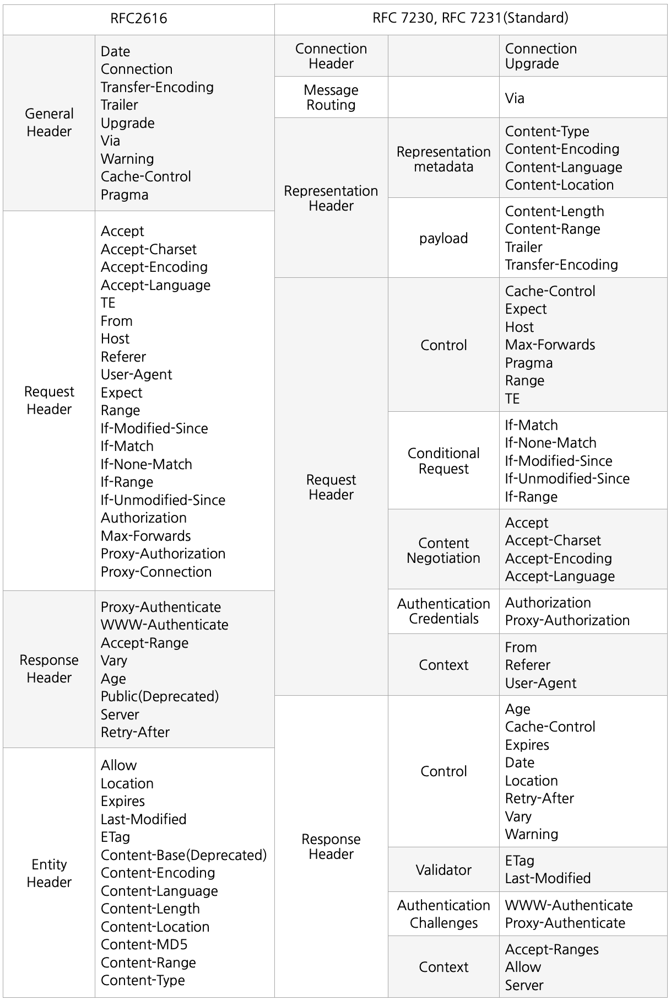

## HTTP 헤더

HTTP 헤더는 클라이언트와 서버가 요청 또는 응답으로 부가적인 정보를 전송할 수 있도록 해준다. 또한 HTTP 헤더는 대소문자를 구별하지 않는 이름과 콜론(:) 다음에 오는 값으로 이루어져 있다.

## HTTP 헤더의 대변화

1999년 RFC2616이 등장하고 나서 쭉 유지되오던 HTTP 헤더부분이 2014년 `RFC7230~7235`가 등장하며 일부분 개편되었다.

제거된 헤더와 성격상 이동이된 헤더들이 위의 그림과 같이 여러개 있었는데, 엔티티 헤더가 `표현 데이터`라고 이름이 바뀐 부분도 주요 변경 사항중 하나였다.

자세한 변경 사항은 [roka88님 블로그](https://roka88.dev/111)에 잘 설명되어 있으니 여기를 참고하면 좋을 것 같다.

그렇다면 본격적으로 HTTP 헤더의 종류와 역할을 알아보자

## 표현 헤더

먼저 알아두어야할 표현 헤더는 다음과 같다. 참고로 표현 헤더는 Request와 Response둘다 사용된다.

- Content-Type: 표현 데이터의 형식
- Content-Encoding: 표현 데이터의 압축 방식
- Content-Language: 표현 데이터의 자연 언어
- Content-Length: 표현 데이터의 길이
- Transfer-Encoding : 분할 전송할 때 사용
- Content-Range: 범위 전송할때 사용
- Content-Location: 반환된 데이터에 대한 대체 위치

## Request 헤더

클라이언트가 사용하는 요청 헤더에는 Control, Conditional Request, Content Negotiation, Authentication Credentials, Context 헤더가 존재한다.

이를 줄여서 컨트롤, 조건부, 협상, 인증, 컨텍스트라고 부르도록 하겠다. 그럼 하나씩 어떤 헤더들이 있는지 살펴보자.

### 컨트롤 헤더

- Cache-Control: 브라우저에 저장된 캐시가 유효한 시간을 나타냄 ex) max-age=60
- Expect: 요청을 적절히 처리하기위해 서버에서 수행되어야하는 기대치
- Host: 요청한 호스트 정보(도메인)
- Max-Fowards: 요청이 지나가는 프록시나 다른 중개자들의 개수를 제한하기 위한 용도
- Pragma: 지시자를 메세지와 함께 넘겨주기 위한 용도, 캐시 제어할때 사용 ex) Pragma: no-cache
- Range: Entity의 일부분이나 범위에 대한 요청에 사용 ex) bytes=500-1500
- TE: Client가 chunk 인코딩을 통해 보내진 응답의 트레일러에 들어있는 헤더를 다룰 수 있는지 여부를 알려주기 위해 사용

### 조건부 헤더

- if-Match: 저장된 리소스가 주어진 ETags의 하나와 일치하는 경우에만 요청을 조건부로 만들고 메소드를 적용
- if-None-Match: 저장된 리소스가 주어진 ETags 모두와 일치하지 않는 경우에만 요청을 조건부로 만들고 메소드를 적용, 캐시(안전 연결용)를 업데이트하거나 이미 존재하는 리소스를 다시 업로드하는 것을 방지하기위해 사용
- if-Modified-Since: 주어진 날짜 이후에 수정된 경우에만 요청을 조건부로 만들고 엔티티가 전송될 것을 기대, 캐시가 만료되었을 때에만 데이터를 전송하는데 사용
- if-Unmodified-Since: 주어진 날짜 이후에 수정되지 않은 경우에만 요청을 조건부로 만들고 엔티티가 전송될 것을 기대
- if-Range: 주어진 etag 또는 날짜가 원격 리소스와 일치할 경우에만 수행되는 조건적 범위 요청을 생성

### 협상 헤더

협상 헤더는 클라이언트가 선호하는 표현의 정보가 나타나 있다.

- Accept: 클라이언트가 선호하는 미디어 타입 전달
- Accept-Charset: 클라이언트가 선호하는 문자 인코딩
- Accept-Encoding: 클라이언트가 선호하는 압축 인코딩
- Accept-Language: 클라이언트가 선호하는 자연 언어(여기서 자연언어는 한국어, 독일어,영어등을 말함)

### 인증 헤더

- Authorization: 클라이언트 인증 정보를 서버에 전달
- Proxy-Authorization: 리소스 접근시 필요한 인증 방법 정의

### 컨텍스트 헤더

- From: 유저 에이전트의 이메일 정보
- Referer: 이전 웹 페이지 주소
- User-Agent: 유저 에이전트 애플리케이션 정보

## Response 헤더

응답헤더는 서버가 사용하는 헤더로 Control, Validator, Authentication Challenges, Context 헤더가 있다.

이를 컨트롤, 검증, 인증, 컨텍스트 헤더라고 부르도록 하겠다.

### 컨트롤 헤더

- Age: 객체가 프록시 캐시에 있었던 초 단위의 시간.
- Cache-Control: 캐시 유효 시간, 초 단위
- Expires: 캐시 만료일 지정
- Date: 메시지가 생성된 날짜
- Location: 페이지 리다이렉션
- Retry-After: 유저 에이전트가 다음 요청을 하기까지 기다려야 하는 시간
- Vary: 오리진 서버로부터 새로운 요청을하는 대신 캐시된 응답을 사용할지를 결정하기위한 향후의 요청 헤더를 매칭할 방법을 정함
- Warning: 가능한 문제들에 대한 정보를 포함하는 일반 경고 필드

### 검증 헤더

- ETag: 리소스의 버전을 식별하는 고유한 문자열 검사기
- Last-Modified: 데이터가 마지막으로 수정된 시간

### 인증 헤더

- WWW-Authenticate: 리소스 접근시 필요한 인증 방법 정의
- Proxy-Authenticate: 프록시 서버 뒤에 있는 리소스에 접근하는데 사용되어야하는 인증 메소드를 정의

### 컨텍스트 헤더

- Accept-Ranges: 서버가 범위 요청을 지원하는지를 나타냄
- Allow: 허용 가능한 HTTP 메서드
- Server: 요청을 처리하는 오리진 서버의 소프트웨어 정보

## 정리

위의 헤더들은 대부분 데이터 전송 포맷, 데이터 응답 포맷, 인증 방식, 클라이언트 정보, 서버 정보, 캐싱에 관한 정보들이다.

이 외에도 보안관련 헤더, 웹소켓 관련헤더등 많은 표준 헤더들이 있다. 이러한 표준 헤더들은 공식 문서를 참조하거나 해야할 것 같다. 물론 이러한 헤더들은 클라이언트와 서버가 서로 약속해서 이름을 만들면 그만이기는 하지만 위와 같은 이름이 표준인 이유는 그만큼 사람들이 많이 사용하기 때문일 것이다. 헤더에 대한 규약을 한번 정리해보자고 포스팅하게 되었는데 이제서야 마무리할 수 있어서 유익한 포스팅 시간이 아니었나 싶다.

## 참고

- [roka88님 블로그](https://roka88.dev/111)
- [모든 개발자를 위한 HTTP 웹 기본 지식](https://www.inflearn.com/course/http-%EC%9B%B9-%EB%84%A4%ED%8A%B8%EC%9B%8C%ED%81%AC/dashboard)
- [HTTP 헤더 - MDN](https://developer.mozilla.org/ko/docs/Web/HTTP/Headers)
