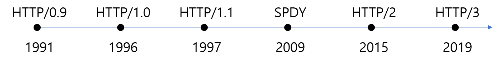

## http의 역사



위의 표로 간단하게 http의 역사에 대해 정리해 보았다. 이제 각각의 http의 버전별 특징과 어떤 것을 개선하여 등장하게 되었는지 알아보도록 하자.

## HTTP/0.9 - 원라인 프로토콜

1989년 제네바의 CERN에서 일하고 있던 [Tim Berners-LEE](https://ko.wikipedia.org/wiki/%ED%8C%80_%EB%B2%84%EB%84%88%EC%8A%A4%EB%A6%AC)는 인터넷의 하이퍼텍스트 시스템을 만들기 위한 제안을 하였다. 이렇게 HTML, HTTP, WorldWideWeb, httpd의 초기 버전이 1990년 말에 완료되었고 첫번째 서버는 1991년 초에 CERN 외부에서 가동을 시작하게 되었다.

초기에는 버전 번호가 존재하지 않았지만, 이후에 다른 버전들과 구분하기 위해서 0.9라는 버전을 붙이게 되었다. 0.9 버전은 단일 라인으로 구성 되었으며 path는 GET이 유일했다. 이렇게 제한적인 기능을 갖고 있었던 HTTP/0.9는 다음과 같은 특징을 갖고 있었다.

- 클라이언트-서버, 요청-응답 프로토콜
- TCP/IP 링크를 통해 실행되는 ASCII 프로토콜
- 하이퍼 텍스트 문서(HTML)을 전송하도록 설계
- 서버와 클라이언트 간의 연결은 모든 요청 후에 닫힌다.

## HTTP 1.0 - HTTP의 성장

최초의 인기 브라우저 Mosaic가 탄생하고, 1994년 Netscape Navigator 1.0이 출시되면서 인터넷의 성장은 날이 갈수록 거대해졌다. 같은 해 W3C가 만들어지며 HTML의 발전을 도모하게 되었고, 이와 비슷하게 HTTP 프로토콜 개선에 초점을 맞추기 위해 HTTP-WG가 설립되었다. 마지막으로 1994~1995 기간에 전화 접속 인터넷 엑세스가 제공되기 시작하며 `인터넷의 붐`이 도래했다.

이러한 성장을 통해 1996년 5월 HTTP-WG는 HTTP/1.0 구현의 일반적인 사용을 문서화한 [RFC 1945](https://tools.ietf.org/html/rfc1945)를 발표하였다.

이는 다음과 같은 요청과 응답 포맷으로 구성되었다.

```http
GET /mypage.html HTTP/1.0
User-Agent: NCSA_Mosaic/2.0 (Windows 3.1)

200 OK
Date: Tue, 15 Nov 1994 08:12:31 GMT
Server: CERN/3.0 libwww/2.17
Content-Type: text/html
<HTML>
A page with an image
  
</HTML>
```

이렇게 발표된 HTTP/1.0의 특징은 다음과 같다.

- 버전 정보가 각 요청 사이내로 전송되기 시작했다. (HTTP/1.0 이 GET 라인에 붙은 형태로)
- 상태 코드 라인 또한 응답의 시작 부분에 붙어 전송되어, 브라우저가 요청에 대한 성공과 실패를 알 수 있고 그 결과에 대한 동작(특정 방법으로 그것의 로컬 캐시를 갱신하거나 사용하는 것과 같은)을 할 수 있게 되었다.
- HTTP 헤더 개념은 요청과 응답 모두를 위해 도입되어, 메타데이터 전송을 허용하고 프로토콜을 극도로 유연하고 확장 가능하도록 만들어주었다.
- 새로운 HTTP 헤더의 도움으로, 평이한 HTML 파일들 외에 다른 문서들을 전송하는 기능이 추가되었다(Content-Type 덕분에).

## HTTP/1.1 - HTTP의 표준

1995년부터 다양한 HTTP/1.0 구현이 동시에 진행되었고, 몇달 뒤 1997년 초에 HTTP/1.1이 발표되었다. 그 후 2년 반 후인 199년 6월 여러 개선 사항과 업데이트가 표준에 통합되어 [RFC 2616](https://tools.ietf.org/html/rfc2616)으로 출시 되었다.

HTTP / 1.1 표준은 이전 버전에서 발견 된 많은 프로토콜 모호성을 해결하고 keep-alive 연결, chunk encoding 전송, 바이트 범위 요청, 추가 캐싱 메커니즘, 전송 인코딩 및 요청 파이프 라이닝과 같은 여러 중요한 성능 최적화를 도입했다. 좀더 보완된 특징은 다음과 같다.

- 커넥션이 재사용될 수 있게 하여, 탐색된 단일 원본 문서 내로 임베드된 리소스들을 디스플레이하기 위해 사용된 커넥션을 다시 열어 시간을 절약하게 하였다.
- 파이프라이닝을 추가하여, 첫번째 요청에 대한 응답이 완전히 전송되기 이전에 두번째 요청 전송을 가능케 하여, 커뮤니케이션 레이턴시를 낮췄다.
- 청크된 응답 또한 지원된다.
- 추가적인 캐시 제어 메커니즘이 도입되었다.
- 언어, 인코딩 혹은 타입을 포함한 컨텐츠 협상이 도입되어, 클라이언트와 서버로 하여금 교환하려는 가장 적합한 컨텐츠에 대한 동의를 가능케 했다.
- Host 헤더 덕분에, 동일 IP 주소에 다른 도메인을 호스트하는 기능이 서버 코로케이션을 가능케한다.

아래는 하나의 단일 커넥션을 통한 요청의 전형적인 전체 흐름의 예시이다.

```http
GET /en-US/docs/Glossary/Simple_header HTTP/1.1
Host: developer.mozilla.org
User-Agent: Mozilla/5.0 (Macintosh; Intel Mac OS X 10.9; rv:50.0) Gecko/20100101 Firefox/50.0
Accept: text/html,application/xhtml+xml,application/xml;q=0.9,*/*;q=0.8
Accept-Language: en-US,en;q=0.5
Accept-Encoding: gzip, deflate, br
Referer: https://developer.mozilla.org/en-US/docs/Glossary/Simple_header

200 OK
Connection: Keep-Alive
Content-Encoding: gzip
Content-Type: text/html; charset=utf-8
Date: Wed, 20 Jul 2016 10:55:30 GMT
Etag: "547fa7e369ef56031dd3bff2ace9fc0832eb251a"
Keep-Alive: timeout=5, max=1000
Last-Modified: Tue, 19 Jul 2016 00:59:33 GMT
Server: Apache
Transfer-Encoding: chunked
Vary: Cookie, Accept-Encoding

(content)


GET /static/img/header-background.png HTTP/1.1
Host: developer.mozilla.org
User-Agent: Mozilla/5.0 (Macintosh; Intel Mac OS X 10.9; rv:50.0) Gecko/20100101 Firefox/50.0
Accept: */*
Accept-Language: en-US,en;q=0.5
Accept-Encoding: gzip, deflate, br
Referer: https://developer.mozilla.org/en-US/docs/Glossary/Simple_header

200 OK
Age: 9578461
Cache-Control: public, max-age=315360000
Connection: keep-alive
Content-Length: 3077
Content-Type: image/png
Date: Thu, 31 Mar 2016 13:34:46 GMT
Last-Modified: Wed, 21 Oct 2015 18:27:50 GMT
Server: Apache

(image content of 3077 bytes)
```

이후 2014년 RFC 7230, 7231, 7232, 7233, 7234, 7235 버전으로 업데이트가 되었고, 마침 RFC 번역을 해둔 분이 있어서 RFC 문서 내용에 대해 궁금하다면 아래 링크를 참고해보는 것도 좋을 듯 하다.

- [RFC 관련 이병록님 블로그](https://roka88.dev/category/RFC)

## SPDY 와 이를 기반으로한 HTTP2의 등장

SPDY는 Google에서 개발한 시험용 프로토콜이며 2009년 중반에 발표되었다. 이 프로토콜의 주요 목표는 HTTP/1.1의 알려진 성능 제한을 해결하여 웹페이지의 로드 지연 시간을 줄이는 것이었다.

> 지금까지 우리는 SPDY를 실험실 조건에서만 테스트했습니다. 초기 결과는 매우 고무적이었습니다. 시뮬레이션된 홈 네트워크 연결에서 상위 25개 웹사이트를 다운로드할 때, 성능이 상당히 개선되었으며 페이지가 최대 55% 더 빨리 로드되었습니다. (Chromium 블로그)

이러한 성능 향상에 힘입어 SPDY를 사용하는 사이트가 늘어나게 되었고 사실상의 표준이 되었다. 이러한 상황을 주시하고 있던 HTTP-WG는 HTTP/2 표준을 선보이려는 노력을 했고 이 프로토콜의 출발점을 SPDY 사양을 채택하게 되었다. 이렇게 2012년부터 2015년까지 3년간의 노력으로 HTTP/2 표준이 발행되게 되었다. 그렇게 몇년간 함께 발전해온 SPDY는 지원을 중단하며, HTTP2가 널리 채택된다는 말을 남기고 사라지게 되었다.

HTTP2와 HTTP1.1의 차이점은 간략하게 아래와 같다. 좀더 자세하게 확인하고 싶다면 [introduction to HTTP/2 - 구글](https://developers.google.com/web/fundamentals/performance/http2?hl=ko)사이트를 참고하길 바란다.

- 바이너리 프레이밍 계층
- 스트림, 메시지 및 프레임
- 요청 및 응답 다중화
- 스트림 우선순위 지정
- 출처당 하나의 연결
- 흐름 제어
- 서버 푸시
- 헤더 압축

## HTTP3 - 지켜볼만한 HTTP2의 차기 버전

HTTP/3은 `UDP 기반의 QUIC 프로토콜`을 사용한다. 속도가 느린 TCP를 UDP로 바꿔서 대대적으로 HTTP를 손보는 방법이다. 아직 이 부분에 대해서는 아는 정보가 많이 없어서 [읽어볼만한 링크](https://evan-moon.github.io/2019/10/08/what-is-http3/)로 글을 대체하고 이만 글을 마칠까 한다.

이번에 HTTP에 대해 공부하면서 [오라일리 러닝 HTTP/2](http://www.yes24.com/Product/Goods/58007534)의 목차를 보고 흥미를 느꼈는데 다음에 시간이 나면 한번 사서 정독하고 이 글을 좀 더 보충하고 싶다.

## 참고

- [HTTP의 진화 - MDN](https://developer.mozilla.org/ko/docs/Web/HTTP/Basics_of_HTTP/Evolution_of_HTTP)
- [HTTP/2 알아보기 - whatap](https://www.whatap.io/ko/blog/38/)
- [HTTP/2 소개 - web fundamentals](https://developers.google.com/web/fundamentals/performance/http2?hl=ko)
- [HTTP의 역사 - hpbn.co](https://hpbn.co/brief-history-of-http/)
- [HTTP/2 - 나무위키](https://namu.wiki/w/HTTP/2)
- [HTTP - 위키백과](https://ko.wikipedia.org/wiki/HTTP)
