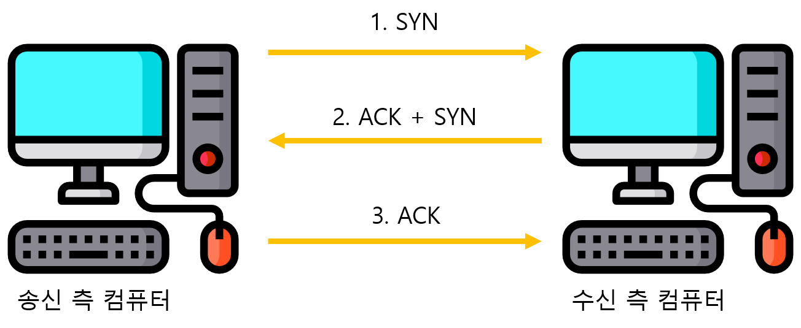
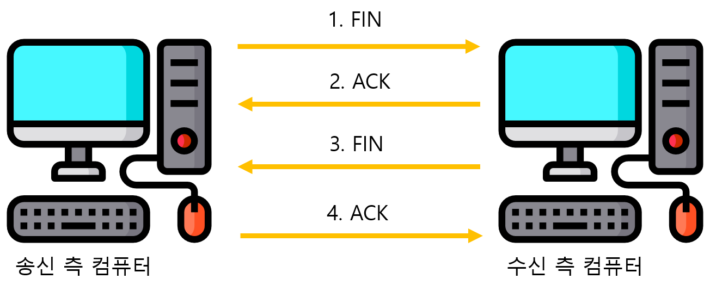

## 서론

이번 글에서는 네트워크 전송계층인 TCP와 UDP에 대해 알아보고 그 차이점은 어떤 것들이 있는지 알아보도록 하겠다.

## TCP란?

TCP는 Transmission Control Protocol의 약자로 인터넷 프로토콜 스위트(IP)의 핵심 프로토콜 중 하나로, IP와 함께 TCP/IP라는 명칭으로도 널리 불린다. TCP 전송 계층은 송신 측 TCP 포트에서 수신 측 TCP 포트로 바이트 스트림을 전송하는 연결형 데이터 전달 서비스를 제공한다.

## TCP 작동 흐름

TCP 프로토콜의 작동은 크게 세가지 흐름으로 구분하는데 다음과 같다.

1. 연결 생성(Connection establishment)
2. 자료 전송(Data transfer)
3. 연결 종료(Connection termination)

이 중 연결 생성에서 `3 way handshake` 과정으로 연결을 생성하는데 이 과정은 다음과 같다.

1. SYN: 클라이언트가 서버에게 SYN 메시지를 보낸다. 이 메시지에 포함된 시퀀스 번호는 클라이언트가 임의로 설정한 값 A.
2. SYN-ACK: 서버가 클라이언트에게 SYN-ACK 메시지로 응답한다. 이 메시지에 포함된 시퀀스 번호는 서버가 임의로 설정한 값 B, 응답 번호는 (A + 1).
3. ACK: 클라이언트가 서버에게 ACK 메시지를 보낸다. 이 메시지에 포함된 응답 번호는 (B + 1).

이후 연결이 생성되면 자료를 전송한다. 마지막으로 연결 종료에서는 이와 비슷한 `4 way handshake`를 사용하여 연결을 종료하게 된다.

이는 다음과 같은 과정으로 이루어 진다.

1. FIN : 송신 측 컴퓨터가 수신 측 컴퓨터로 연결 종료 요청
2. ACK : 수신 측 컴퓨터가 송신 측 컴퓨터로 연결 종료 응답
3. FIN : 수신 측 컴퓨터가 송신 측 컴퓨터로 연결 종료 요청
4. ACK : 수신 측 컴퓨터가 송신 측 컴퓨터로 연결 종료 응답

## TCP 흐름 제어

TCP는 원래의 데이터를 패킷이라는 데이터로 분할해서 전송하기 때문에 수신 측 컴퓨터는 수신한 패킷을 재결합하여 원래의 데이터로 만들어야 한다. 이 때 네트워크 순서에따라 패킷 도착 순서가 바뀔수도 있고 도중에 패킷이 사라질 수도 있다. 이를 위해 TCP는 신뢰성을 보장하기 위해 패킷번호를 사용한다.

## TCP 혼잡 제어

초기 TCP에는 없었던 요소이지만, 사람들이 늘어나다보니 네트워크 부하로 인해 등장하게 되었다.

이 부분에 대한 설명은 [나무위키](https://namu.wiki/w/TCP#s-1.2.3)에 자세한 예시까지 나와있기 때문에 링크로 대신하려고 한다.

간단하게 결론만 말하자면 위의 혼잡 제어 기능을 통해, 모든 사용자들이 네트워크 상황에 따라 속도를 조절하여 끊기지 않는 네트워크를 가질 수 있게 되었다.

## TCP의 특징

위에서 살펴본 TCP의 연결설정 특징과 더불어 TCP의 특징을 정리해보자

- 연결형 서비스로 가상 회선 방식 제공
- 3-way handshaking 과정을 통한 연결 설정과 4-way handshaking을 통한 연결 해제
- 흐름 제어
- 혼잡 제어
- 높은 신뢰성 보장
- 속도가 느림
- 전이중(Full-Duplex), 점대점(Point to Point)방식

## UDP란?

UDP는 User Datagram Protocol의 축약어이다. 비연결 지향 프로토콜로, TCP와 달리 패킷이나 흐름제어, 단편화 및 전송 보장등의 기능을 제공하지 않는다. UDP 헤더는 TCP 헤더보다 간단하기 때문에 상대적으로 통신 과부하가 적다. UDP 헤더의 크기는 8바이트로 TCP 헤더의 크기(20바이트)보다 작다.

실시간 스트리밍 서비스같은 영상을 주고받을 때 `속도를 개선하기 위해 등장`하게 되었다.

## UDP의 특징

- 비연결형 서비스로 데이터그램 방식을 제공한다.
- 정보를 주고 받을 때 정보를 보내거나 받는다는 신호절차를 거치지 않는다.
- UDP헤더의 CheckSum 필드를 통해 최소한의 오류만 검출한다.
- 신뢰성이 낮다.
- TCP보다 속도가 빠르다.

## TCP VS UDP

이제 두개의 프로토콜의 차이점을 표로 간단하게 확인해 보자

| 특징           | TCP                                                               | UDP                                        |
| -------------- | ----------------------------------------------------------------- | ------------------------------------------ |
| 연결방식       | 연결형                                                            | 비 연결형                                  |
| 패킷 교환 방식 | 가상 회선 방식                                                    | 데이터그램 방식                            |
| 전송 순서      | 보장                                                              | 순서가 바뀔 수 있음                        |
| 수신 여부 확인 | 수신 여부 확인함                                                  | 수신 여부 확인x                            |
| 통신 방식      | 1:1 통신                                                          | 1:1 or 1:N or N:N                          |
| 신뢰성         | 높음                                                              | 낮음                                       |
| 속도           | 느림                                                              | 빠름                                       |
| 사용되는 곳    | 일반적인 네트워크, 신뢰성이 중요한 곳(ex. 파일 전송, 이메일 전송) | 속도가 중요한 네트워크 (ex.게임, 스트리밍) |

## 참고

- [네트워크 개론](http://www.yes24.com/Product/Goods/76073424)
- [TCP 나무위키](https://namu.wiki/w/TCP)
- [TCP와 UDP의 특징과 차이](https://mangkyu.tistory.com/15)
- [UDP 나무위키](https://namu.wiki/w/UDP)
