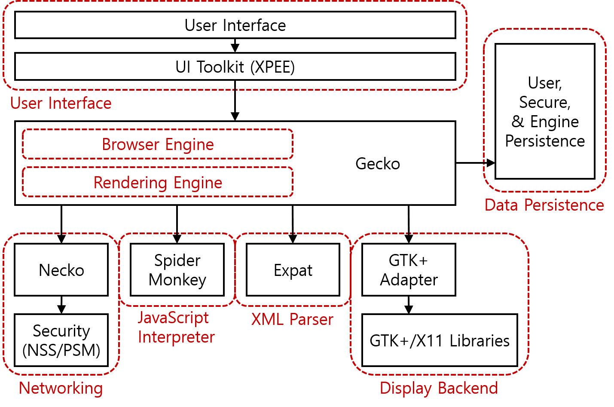
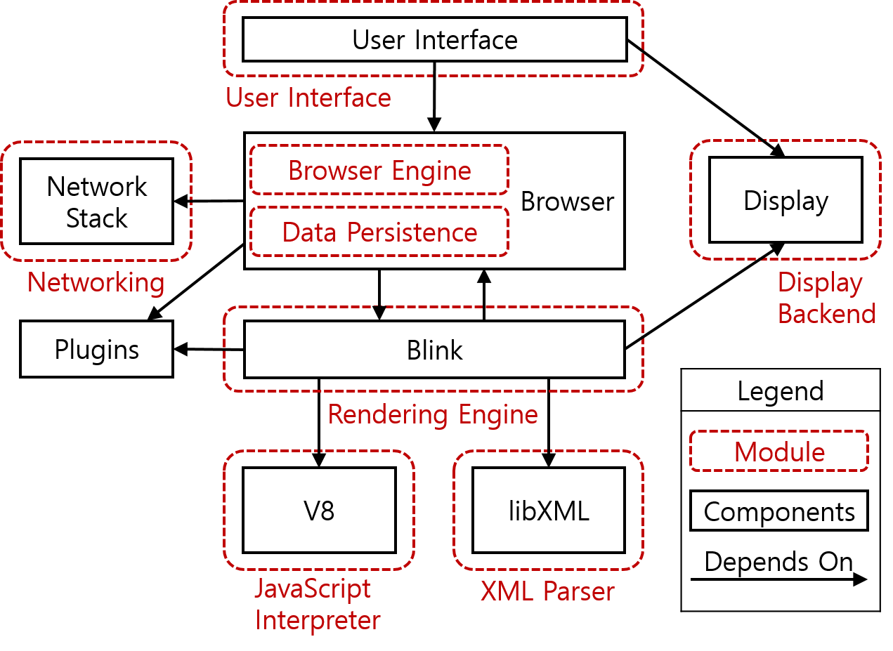

## 서론

먼저 이 글을 쓰게된 이유는 브라우저가 어떻게 이루어져 있는지 또, html,css, javascript파일들을 어떤 순서로 어떻게 처리하는지를 정리하기 위해서이다. 먼저 브라우저의 구성부터 살펴보도록 하자.

## 브라우저의 기본 구조

위 그림은 [네이버 사이트](https://d2.naver.com/helloworld/59361)에서 발췌해왔다. 각각의 설명또한 확인해보도록 하자.

1. 사용자 인터페이스 : 주소 표시줄, 이전/다음 버튼, 북마크 메뉴 등. 요청한 페이지를 보여주는 창을 제외한 나머지 모든 부분이다.
2. 브라우저 엔진 : 사용자 인터페이스와 렌더링 엔진 사이의 동작을 제어.
3. 렌더링 엔진 : 요청한 콘텐츠를 표시. 예를 들어 HTML을 요청하면 HTML과 CSS를 파싱하여 화면에 표시함.
4. 통신 : HTTP 요청과 같은 네트워크 호출에 사용됨. 이것은 플랫폼 독립적인 인터페이스이고 각 플랫폼 하부에서 실행됨.
5. UI 백엔드 : 콤보 박스와 창 같은 기본적인 장치를 그림. 플랫폼에서 명시하지 않은 일반적인 인터페이스로서, OS 사용자 인터페이스 체계를 사용.
6. 자바스크립트 해석기 : 자바스크립트 코드를 해석하고 실행.
7. 자료 저장소 : 이 부분은 자료를 저장하는 계층이다. 쿠키를 저장하는 것과 같이 모든 종류의 자원을 하드 디스크에 저장할 필요가 있다. HTML5 명세에는 브라우저가 지원하는 '웹 데이터 베이스'가 정의되어 있다.

물론 아래 그림과 같이 브라우저마다 구조가 조금씩 다를 수 있다.

| 파이어폭스 브라우저                                   | 크롬 브라우저                                       |
| ----------------------------------------------------- | --------------------------------------------------- |
|  |  |

## 브라우저의 렌더링 과정

위의 그림은 브라우저의 렌더링 과정을 도식화한 것이다. 이를 간단히 순서대로 설명해보자면 다음과 같다.

1. 브라우저는 HTML, CSS, 자바스크립트, 이미지, 폰트 파일 등 렌더링에 필요한 리소스를 요청하고 서버로부터 응답을 받는다.
2. 브라우저의 렌더링 엔진은 서버로부터 응답된 HTML과 CSS를 파싱하여 DOM과 CSSOM을 생성하고 이들을 결합하여 렌더 트리를 생성한다.
3. 브라우저의 자바스크립트 엔진은 서버로부터 응답된 자바스크립트를 파싱하여 AST를 생성하고 바이트코드로 변환하여 실행한다. 이때 자바스크립트는 DOM API를 통해 DOM이나 CSSOM을 변경할 수 있다. 변경된 DOM과 CSSOM은 다시 렌더 트리로 결합된다.
4. 렌더 트리를 기반으로 HTML 요소의 레이아웃(위치와 크기)을 계산하고 브라우저 화면에 HTML 요소를 페인팅한다.

이제, 위의 과정을 좀더 자세하게 알아보도록 하자.

### HTML 파싱과 DOM 생성

인터넷 주소를 치면 그 사이트에 알맞는 index.html 파일을 가져오게 된다. 브라우저 렌더링 엔진은 HTML 문서를 파싱하여 브라우저가 이해할 수 있는 자료구조인 `DOM`을 생성하는데 자세한 과정은 다음과 같다.

1. 문자열로 변환된 HTML 문서를 읽고 이를 문법적 의미를 갖는 코드의 최소 단위인 토큰들로 분해한다.
2. 이 토큰들은 다시 객체로 변환하여 노드들을 생성한다. 또한 이 노드들은 트리의 자료구조로 요소 간의 관계를 나타내는데 이러한 노드의 트리 자료구조를 DOM이라고 한다.

### CSS 파싱과 CSSOM 생성

앞서말한 HTML 파싱을 하다가 CSS파일을 로드하는 link태크나 style태그를 만나면 DOM 생성을 일시 중지하고 CSS파일을 서버로부터 요청하고, HTML과 동일한 파싱과정을 거쳐 `CSSOM`를 생성한다. 이후 CSS 파싱을 전부 완료한 뒤에 다시 HTML을 파싱해 DOM 생성을 재개한다.

### 렌더 트리 생성

위에서 생성된 DOM과 CSSOM을 결합하여 `렌더 트리`로 결합한다. 렌더 트리는 렌더링을 위한 트리 구조의 자료구조로, 브라우저 화면에 렌더링되는 노드만으로 구성된다.

### 자바스크립트 파싱과 실행

script 태그를 만나면 마찬가지로 HTML 파싱 과정을 중단하고 자바스크립트 파일을 불러오고 자바스크립트 코드를 파싱한다. 자바스크립트 엔진은 이를 해석하여 `AST(추상적 구문 트리)`를 생성한다. 그리고 AST를 기반으로 인터프리터가 실행할 수 있는 중간 코드인 바이트 코드를 생성하여 실행한다.

### 리플로우와 리페인트

만약 자바스크립트 코드에 DOM이나 CSSOM을 변경하는 DOM API가 사용된 경우 DOM이나 CSSOM이 변경된다. 이때 변경된 DOM과 CSSOM은 다시 렌더 트리로 결합되고 변경된 렌더 트리를 기반으로 레이아웃과 페인트 과정을 거쳐 브라우저의 화면에 다시 렌더링한다. 이를 리플로우, 리페인트라 한다. 리플로우는 레이아웃 계산을 다시 하는 것을 말하며, 리페인트는 재결합된 렌더트리를 기반으로 다시 페인트를 하는 것을 말한다.

## 마치며

이번 글에서는 브라우저의 구조가 어떻게 되어 있고, 문서를 어떤식으로 불러와 렌더링하는 지 과정에 대해 알아보았다. 프론트엔드 개발자라면 꼭 알고 있어야 하는 내용이었는데 이제서야 좀 자세하게 정리해볼 수 있어서 좋은 의미가 있었던 시간이었다.

## 참고

- [브라우저 동작 원리 - poiemaweb](https://poiemaweb.com/js-browser)
- [브라우저는 어떻게 동작하는가? - naver](https://d2.naver.com/helloworld/59361)
- [브라우저의 렌더링 과정 - 모던 자바스크립트 Deep Dive](http://www.yes24.com/Product/Goods/92742567)
- [브라우저 렌더링 - Beomy 블로그](https://beomy.github.io/tech/browser/browser-rendering/)
