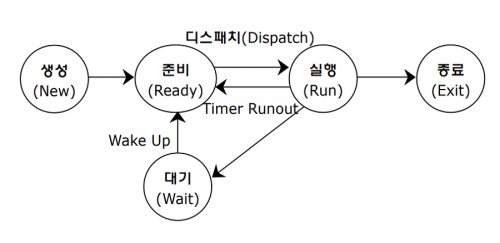

이번 글에서는 면접 필수 질문으로도 유명한 프로세스와 스레드에 대해 알아보고 그 차이점에는 어떤 것들이 있는지 알아보도록 하려고 한다.

그럼 시작해보도록 하자~🚀

## 프로세스?

먼저 용어에 대해 깔끔하게 정립하고갈 필요가 있을 것 같다. 프로세스를 알아보려면 먼저 그와 관련된 프로그램의 정의에 대해 알아보도록 하자. 프로그램이란, `작업을 위해 실행할 수 있는 파일`을 말한다. 그렇다면 프로세스는 무엇일까?

프로세스는 바로, `실행중인 프로그램`을 뜻한다.

프로그램과 프로세스를 요리에 비유해보자면 프로그램은 레시피📜가 될 것이고, 프로세스는 요리🍔가 될 것이다. 이제 프로그램, 프로세스, 스레드의 각각의 연관성과 구조에 대해 알아보고 특징에 대해서도 정리를 해보도록 하자.

## 프로그램을 어떻게 프로세스로 바꾸지?

프로그램을 실행하기 위해서, 즉, 프로그램을 프로세스로 바꾸기 위해서는 어떠한 작업을 거칠까?
운영체제는 프로그램을 실행하기 위해서, 프로그램을 메모리의 적당한 위치로 가져온다. 이와 동시에 운영체제는 프로세스를 관리하기 위해 `PCB(Process Control Block)` 라는 것을 생성한다.

PCB에는 프로그램을 실행하기 위한 다양한 정보들이 들어있다. 간단하게 안의 정보들을 설명해보자면, 프로세스 구분자라고도 불리는 PID와 메모리 관련 정보들과 프로그램 카운터와 같은 각종 중간값들이 저장된다. 자세한 정보는 [PCB 나무위키](https://ko.wikipedia.org/wiki/%ED%94%84%EB%A1%9C%EC%84%B8%EC%8A%A4_%EC%A0%9C%EC%96%B4_%EB%B8%94%EB%A1%9D)를 참조해보면 좋을 것 같다.

이렇게 OS(운영체제)는 PCB를 이용하여 프로그램을 프로세스로 만들어 프로그램을 실행한다. 이러한 프로그램이 프로세스로 변환되고 실행이 끝나면 다시 프로그램으로 돌아가는 과정을 프로세스 상태라고도 하는데 보통 크게 `5가지`로 나누어진다.

- 생성 상태 : 프로그램을 메모리에 가져와 실행 준비가 완료된 상태, PCB가 생성된다.
- 준비 상태 : 실행을 기다리는 모든 프로세스가 자기 차례를 기다리는 상태
- 실행 상태 : 선택된 프로세스가 CPU를 사용하는 상태
- 대기 상태 : 실행 상태에 있는 프로세스가 입출력을 요청하면 입출력이 완료될 때 까지 기다리는 상태
- 완료 상태 : 프로세스가 종료된 상태, PCB가 삭제된다.

이를 그림으로 표현하자면 아래와 같다.

## 프로세스의 구조

앞에서는 프로그램이 어떻게 프로세스가 되는지, 그리고 그에따른 프로세스 상태변화에 대해서 다뤄 보았다.

그렇다면 이제 프로세스가 어떤 구조를 가지고 있는지 각각의 구조와 특징에 대해 살펴보도록 하겠다.

위의 그림처럼 프로세스는 Code, Data, Stack, Heap 영역의 네가지 구조로 되어있다.
각각의 구조의 특징은 다음과 같다.

- 코드 영역(code area) : 프로그래머가 작성한 프로그램이 코드 영역에 작성된다
- 데이터 영역(data area) : 코드가 실행되면서 사용한 변수나 파일들의 각종 데이터들이 모여있다.
- 스택 영역(stack area) : 호출한 함수가 종료되면 되돌아올 메모리의 주소를 스택에 저장하거나 변수 사용 범위에 영향을 미치는 영역을 구현 할때 사용된다.
- 힙 영역(heap area) : 동적으로 할당되는 데이터들을 위해 존재하는 공간이다. ex) malloc

위의 특징 외에도 코드 영역과 데이터 영역은 선언할 때 그 크기가 결정되는 `정적 영역`이지만 스택 영역과 힙 영역은 프로세스가 실행되는 동안 크기가 늘어났다 줄어들기도 하는 `동적 영역`이다.

프로그램이 프로세스로 전환되는 과정을 방금 배웠던 영역들과 연관 시켜보자면 다음과 같다.

📌사용자가 프로그램을 실행하면 운영체제는 프로그램을 메모리에 가져와 코드 영역에 넣고 프로세스 제어 블록(PCB)을 생성한다. 그 후 메모리에 스택 영역과 힙 영역을 확보한 후 프로세스를 실행한다.

## 스레드란?

오늘날의 운영체제는 프로세스의 낭비 요소를 제거하고 프로세스 작업의 유연성을 얻기 위해 멀티 스레드 형식을 사용한다.

스레드의 정의는 다음과 같다.

`스레드` : 프로세스의 코드에 정의된 절차에 따라 CPU에 작업 요청을 하는 실행 단위이다.

위의 그림 처럼 하나의 프로세스는 여러개의 스레드를 가질 수 있고 이러한 동작 방식을 멀티 스레드 방식이라고 한다.

초기의 컴퓨터는 한개의 스레드를 가진 프로세스만 있는 개념이었지만, 기술이 점점 발전하다보니 여러개의 코어를 가진 CPU가 등장 했고 이에따라 멀티스레드 기능을 지원했다고 한다.

> 번외로, 코어가 하드웨어단에서의 물리적 구성 단위라면, 쓰레드는 소프트웨어 관점에서의 논리적 작업 처리 단위이다. [하이퍼스레딩](https://www.intel.co.kr/content/www/kr/ko/gaming/resources/hyper-threading.html)이라는 기술이 생겨나면서 코어보다 쓰레드가 더 많은 상황이 나오게 되었다고 한다.

## 멀티프로세스? 멀티스레드? 어떤게 더 좋은거지?

먼저, 멀티프로세스와 멀티스레드의 용어의 정의를 정리해보자.

- 멀티 프로세스 : 하나의 응용 프로그램을 여러 개의 프로세스로 구성하여 각 프로세스가 하나의 작업을 처리하도록 하는 것이다.
- 멀티 스레드 : 하나의 응용 프로그램을 여러 개의 스레드로 구성하고 각 스레드로 하여금 하나의 작업을 처리하도록 하는 것이다.

이제 각각의 장단점에 대해서 알아보도록 하겠다.

| 종류          | 장점                                                                                                                       | 단점                                                                                                                                                                                               |
| ------------- | -------------------------------------------------------------------------------------------------------------------------- | -------------------------------------------------------------------------------------------------------------------------------------------------------------------------------------------------- |
| 멀티 프로세스 | 하나의 프로세스가 죽어도 다른 프로세스에게는 영향을 끼치지 않는다.                                                         | 각각 독립된 메모리 영역을 갖고 있어 작업량이 많을 수록 오버헤드가 발생하고 [Context Switching](https://ko.wikipedia.org/wiki/%EB%AC%B8%EB%A7%A5_%EA%B5%90%ED%99%98)으로 인한 성능 저하를 유발한다. |
| 멀티 스레드   | 프로세스의 응답시간이 단축되고 시스템의 처리율이 향상된다. 또한 코드영역과 데이터 영역을 공유하기 떄문에 자원 소모가 적다. | 프로그램 디버깅이 어렵고 하나의 스레드에 문제가 생기면 전체적인 프로세스에 영향을 끼치게 된다.                                                                                                     |

## 마치며

이번 글에서는 `프로그램, 프로세스, 스레드의 정의와 프로세스와 스레드의 구조, 프로세스의 상태`에 대해 알아보았다. 또한, `멀티 프로세스와 멀티 스레드를 각각의 장단점`을 들며 비교해 보았다.

아직, 글을 쓰는 재주가 부족한 것 같아 이 글을 쓰며 많은 글을 읽었는데도 정리하는 능력이 조금 부족한 것 같다. 이 글을 읽고도 만약 프로세스와 스레드의 차이나 그 부가적인 정보에 좀더 궁금한게 있다면 아래 참고 링크를 한번씩 들어가 보는 것도 좋을 것 같다.

나보다 더 정리를 잘하시는 분들이어서 아래 글들을 다 읽으면 분명 프로세스와 스레드에 대해 좀 더 확실하게 이해할 수 있을 것 같다.👍

## 참고

- [프로세스와 스레드의 차이](https://gmlwjd9405.github.io/2018/09/14/process-vs-thread.html)
- [쉽게 배우는 운영체제](http://www.yes24.com/Product/Goods/62054527)
- [process & Thread](https://www.youtube.com/watch?v=LLiV5Yz1AWg&t=1s)
- [Process vs Thread](https://www.youtube.com/watch?v=DmZnOg5Ced8)
- [Thread vs Process 컴퓨터공학 기본](https://www.youtube.com/watch?v=RrfASw-jfZ4)
- [프로세서, 코어, 쓰레드](https://m.blog.naver.com/sjc02183/221844611260)
