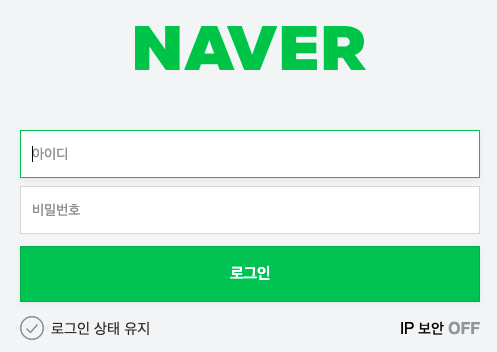

이번 포스팅에서는 우테캠을 진행하면서 느꼈던 input에 대한 UX적 관점에 대해서 써볼까 한다. 첫 주차에 진행했던 회원가입 로그인 화면을 기준으로 느낀점과 피드백 받은 것을 토대로, 어떤 인풋창이 사용자의 경험을 향상시켜줄지 고민해본 포스팅이라고 보면 될 것 같다.

## UX란?

> 사용자 경험(User Experience, 간단히 UX)은 사용자가 어떤 시스템, 제품, 서비스를 직, 간접적으로 이용하면서 느끼고 생각하게 되는 총체적 경험을 말한다. 단순히 기능이나 절차상의 만족뿐 아니라 전반적인 지각 가능한 모든 면에서 사용자가 참여, 사용, 관찰하고 상호 교감을 통해서 알 수 있는 가치있는 경험이다. - [위키백과](https://ko.wikipedia.org/wiki/%EC%82%AC%EC%9A%A9%EC%9E%90_%EA%B2%BD%ED%97%98)

이처럼 웹 개발자가 갖춰야할 역량중 하나가 사용자 경험을 얼마나 끌어올릴 것인가라고 생각을 해서 이번 기회에 그러한 고민결과를 포스팅을 하게 되었다.

읽었던 글 중 JBEE님이 쓰신 UX글이 인상깊어서 시작하기전 [링크](https://jbee.io/essay/about_frontend/)를 남겨두도록 하겠다.

그럼 UX에 대한 소개는 여기까지 하고 본격적으로 어떻게 프로젝트에서 input UX에 대한 고민을 하고 이를 어떻게 해결했는지 소개해볼까 한다.

## 로그인화면

예시로 들어볼 네이버의 로그인 화면이다. 네이버에서 느낄 수 있었던 UX적 관점은 크게 다음과 같다.

1. 들어가자 마자 아이디 창에 `focus`가 되어있다.
2. 사용자가 어느 인풋창에 포커스가 되어있는지 쉽게 알 수 있게 했다.
3. 아이디 인풋과 비밀번호 인풋에는 `placeholder`로 해당 인풋이 어떤 인풋인지 써있다.
4. 인풋에 검증 조건을 지키지 않은 채 로그인 버튼을 클릭하면 해당 인풋에 `에러 메시지`가 표시된다.

아래에 간단하게 예시를 만들어 놨다. 크게보고 싶다면 [링크](https://stackblitz.com/edit/js-jpa2r4?file=index.js)에 접속해서 보도록 하자.

<https://stackblitz.com/edit/js-jpa2r4?file=index.js>

index.js를 보면 로그인 버튼에 eventlistener를 달아서 로그인을 서버로 보내기 전에 id검증과 pw검증을 진행한 후에 로그인 요청을 서버에 날리도록 하였다.

또한, 나는 개인적으로 사용자의 입장에서 아이디와 비밀번호를 넘어갈 때 커서로 넘어가지 않고 탭키를 사용해서 넘어가는데 되도록이면 id와 비밀번호 사이에 엘리먼트를 넣지 않는 것도 좋은 방법인듯 하다.

만약 엘리먼트가 존재해야 한다면 강제로 아이디 인풋이 포커스 상태일 때 탭을 누르면 비밀번호 인풋창으로 넘어가게끔 js코드를 추가해줘야 하지 않을까? 싶다.

또 네이버나 다음을 보면서 재미있다고 느낀게 두 사이트 둘다 placeholder속성을 사용하지 않고 label속성을 사용해 display 를 바꾸는 형식을 사용했는데 아마 ie9 이하가 placeholder를 지원하지 않아서 인듯 하다.

## 번외: 휴대폰 인풋 자동완성

프로젝트가 끝나고 미처 완성하지 못한 휴대폰 인풋 코드를 우테캠 같이하시는 분이 올려주셔서 나중에 참고해보고자 올려보려고 한다.

구현하고자 하는 것은 번호를 적을 때 -가 자동으로 붙게하는 것이 목적인 코드이고 ctrl+c, ctrl+v로 올렸을때도 잘 동작하는 코드이다. 구현은 아래와 같다.

- [코드 크게보기 링크](https://stackblitz.com/edit/js-y7khxd?file=index.js)

<https://stackblitz.com/edit/js-y7khxd?file=index.js>

## 마치며

1주차에 했던 결과물중 하나인데 올리자 올리자 하던 것을 이제야 올리게 되었다. 위의 과정을 겪으며 UX에 대한 공부도 해봐야겠다는 생각이 들었고 vanilla js가 프론트엔드의 근본이구나 라는것도 느끼게 되었다. 앞으로 까먹지않도록 많은 내용을 포스팅했으면 좋겠다. 아 그리고 검증에는 정규식이 정말 유용하다는 생각도 이번에 들어서 과정이 끝나면 정규식도 한번 공부를 해봐야겠다.
