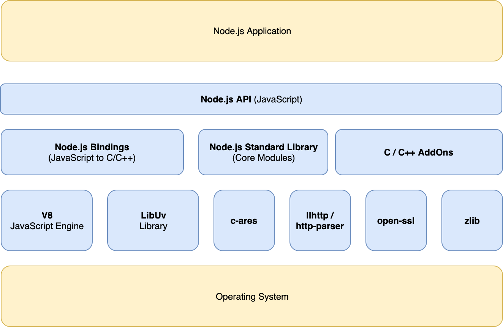

## 글을 쓰게된 이유

평소에 단지 Node.js는 `자바스크립트를 실행하게하는 런타임`이라는 것 외에는 그렇게 깊게 Node.js의 작동방식이나 내부 구조에대해 알아본적이 없어서 한번 자세히 알아보고자 포스팅을 하게 되었다.

이번 기회에 Node.js가 무엇인가?에 대해 자세히 설명할 수 있도록 한번 Node.js에 대해서 쭉 정리를 해보고자 한다.

## Node.js란?

글의 처음에도 말했듯이 Node.js는 Chrome V8 Javascript 엔진으로 빌드된 Javascript 런타임이다. 그렇다면 여기서 런타임이란 것은 무엇을 의미할까? 런타임이란 특정 언어로 만든 프로그램들을 실행할 수 있는 환경을 뜻한다. 즉, 노드는 자바스크립트 실행기라고 생각하면 된다.

아래의 그림은 Node.js 내부 아키텍쳐를 의미한다.

가장 최상단에 Node.js Application이 있다. 그 외 Node.js API, C++ AddOns등등이 있다.

이 중 몇가지 중요한 것들을 간략하게 얘기해 보자면,

- **V8** : Memory Heap, Call Stack, Garbage Collector로 구성되며 자바스크립트 코드를 주어진 OS의 기계 코드로 변환하는 역할을 한다.
- **Libuv** : Thread Pool로 구성이 되며 Event Loop, Event Queue를 처리한다. 비동기 I/O 작업에 초점을 맞춘 C 라이브러리이다.
- **Node.js** Standard Library : setTimeout, fs, http 등의 표준 라이브러리를 지원한다.
- **llhttp** : HTTP 요청, 응답구문 분석등에 사용된다.
- **c-ares** : dns 모듈에서 사용되는 비동기 DNS 요청을 위한 C라이브러리이다.
- **open-ssl** : ssl, crypto 모듈에 사용되는 암호화 함수이다.
- **zlib** : 비동기 및 스트리밍으로 압축 및 압축 해제를 담당하는 인터페이스이다.
- **Node.js API** : Application에서 사용할 노출 된 Javascript API 이다.

## 단일 스레드

싱글 스레드라고도 하는데 Node.js 코드가 하나의 스레드를 가지고 동작한다는 것이다. 이 때문에 우리는 자바스크립트 코드를 동시에 실행시킬 수 없기도 하다. 물론 워커 스레드 기능을 사용한다면 Node.js를 멀티 스레드로 다룰 수 있지만 기본적으로는 Node.js의 코드는 싱글 스레드라고 동작한다고 생각하면 좋을 것 같다.

## 이벤트 루프

이벤트 루프는 Node.js 에서 비동기 작업을 할 때 사용되는 것으로 이벤트 발생 시 호출할 콜백 함수들을 관리하고, 호출된 콜백 함수의 실행 순서를 결정하는 역할을 담당한다.

이벤트 루프에 좀더 완벽하게 이해하고자 한다면 유튜브의 유명한 동영상을 보면된다.

<iframe width="560" height="315" src="https://www.youtube.com/embed/8aGhZQkoFbQ" frameborder="0" allow="accelerometer; autoplay; clipboard-write; encrypted-media; gyroscope; picture-in-picture" allowfullscreen></iframe>

나도 이 영상을 보면서 이벤트 루프의 동작 원리에 대해 좀더 자세하게 알 수 있었고 이벤트 루프가 누가 뭐냐고 물어본다면 항상 이 영상을 먼저 이야기를 꺼낼 정도로 훌륭한 영상이기도 하다.

이 동영상과 더불어 실제 내가 돌린 코드가 어떻게 돌아가고 싶은지 알고 싶다면 위의 동영상 시연에서 사용한 [웹사이트](http://latentflip.com/loupe/?code=JC5vbignYnV0dG9uJywgJ2NsaWNrJywgZnVuY3Rpb24gb25DbGljaygpIHsKICAgIHNldFRpbWVvdXQoZnVuY3Rpb24gdGltZXIoKSB7CiAgICAgICAgY29uc29sZS5sb2coJ1lvdSBjbGlja2VkIHRoZSBidXR0b24hJyk7ICAgIAogICAgfSwgMjAwMCk7Cn0pOwoKY29uc29sZS5sb2coIkhpISIpOwoKc2V0VGltZW91dChmdW5jdGlvbiB0aW1lb3V0KCkgewogICAgY29uc29sZS5sb2coIkNsaWNrIHRoZSBidXR0b24hIik7Cn0sIDUwMDApOwoKY29uc29sZS5sb2coIldlbGNvbWUgdG8gbG91cGUuIik7!!!PGJ1dHRvbj5DbGljayBtZSE8L2J1dHRvbj4%3D)를 통해 실습을 해볼 수 있다.

## 논 블로킹 I/O

위에서 살펴본 이벤트 루프를 활용하면 I/O 작업을 처리할 때 논 블로킹 방식으로 처리가 가능하다. 여기서 논 블로킹이란 이전 작업이 완료될 때 까지 대기하지 않고 다음 작업을 수행하는 것을 말한다. 이 논 블로킹의 이점은 자바스크립트 코드가 아닌 I/O 처리등의 작업이 일어나는 동안 동시에 처리할 수 있다. 더 자세한 예시는 [Node.js 공식 문서](https://nodejs.org/ko/docs/guides/blocking-vs-non-blocking/)를 참고하면 좋을 것 같다.

## 정리

Node.js의 내부 아키텍쳐와 가장 중요한 특징 세가지 싱글 스레드, 이벤트 루프, 논 블로킹 I/O 방식에 대해 살펴보았다.

마지막으로 Node.js를 만든 Lyan Dahl의 Node.js에 관해 후회하는 10가지 영상을 링크하고(?) 글을 마칠까 한다.

앞으로 [Deno](https://github.com/denoland/deno)의 시대가 올까..?

<iframe width="560" height="315" src="https://www.youtube.com/embed/M3BM9TB-8yA" frameborder="0" allow="accelerometer; autoplay; clipboard-write; encrypted-media; gyroscope; picture-in-picture" allowfullscreen></iframe>

## 참고

- [NodeJS Architecture & Concurrency Model](https://blog.usejournal.com/nodejs-architecture-concurrency-model-f71da5f53d1d)
