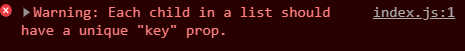

최근에 리액트에서 Key 값을 사용할 때 index를 사용하면 위험하다고 막연하게 알고 있었는데 정확하게 왜 Key값이 필요한지, 내부 구조는 어떻게 되어있는지를 잘 알지 못하는 것 같아 정리할 겸 포스팅을 써보려고 한다.

## 리스트 아이템

일반적으로 우리가 처음 키를 만날 때는 리스트 아이템을 만들때인 것 같다. 아래의 예시를 살펴보도록 하자.

```js
import React from 'react'

const KeyExample = () => {
  const numbers = [1, 2, 3, 4, 5]
  const listItems = numbers.map(number => <li>{number}</li>)

  return <ul>{listItems}</ul>
}

export default KeyExample
```

보통 이런식으로 리스트 아이템을 생성하곤 하는데 여기서 콘솔창을 들어가면 다음과 같은 에러를 만날 수 있다.



각각의 리스트의 아이템이 키값을 가져야 한다는 뜻이다. 보통 우리는 처음에 index를 많이 key값으로 아래와 같이 넣게 된다.

```js
// 좋지 않은 예
import React from 'react'

const KeyExample = () => {
  const numbers = [1, 2, 3, 4, 5]
  const listItems = numbers.map((number, index) => (
    <li key={index}>{number}</li>
  ))

  return <ul>{listItems}</ul>
}

export default KeyExample
```

이렇게 하면 에러가 감쪽같이 사라짐으로 써 마치 에러가 잘 해결된 듯 보인다.

하지만 `순서가 바뀔 수 있는 리스트 아이템`에는 key값에 index를 쓰는 것은 `매우 위험하다`. 도대체 왜 위험한 것일까? 그 이유에 대해 한번 알아보도록 하자.

## 리액트에서 index를 Key값으로 사용하는 것이 안좋은 이유

간단하게 한줄로 요약해보자면 `원하지 않는 데이터가 보여질 수 있기 때문`이다. [링크](https://jsbin.com/wohima/edit?output) 를 들어가서 한번 텍스트를 적고 아이템을 추가해보자. key값을 index로 사용한 아이템은 텍스트를 적은 것이 계속 맨 처음 아이템에 고정되어 있는 것을 볼 수 있다. 이러한 에러때문에 리스트에는 index값이 아닌 고유한 key 값을 사용해야하는 것이다.

그렇다면 이렇게 되는 원리는 무엇일까? 도대체 어떤 렌더링 방식을 사용하고 있기에, 리액트가 이렇게 index값을 사용했을 시 오류가날 수 있는지 한번 알아보도록 하자.

## 리액트 내부 구조에서 Key 값의 의미

이 부분은 리액트 공식문서의 [재조정(Reconciliation)문서](https://ko.reactjs.org/docs/reconciliation.html#recursing-on-children)를 보면 그 해답을 찾을 수 있다.

리액트는 효과적인 랜더링 방식을 위해 O(n)의 복잡도를 가진 휴리스틱 알고리즘을 구현했다고 한다. 이 알고리즘에는 두가지 특징이 있다.

- 서로 다른 타입의 두 엘리먼트는 서로 다른 트리를 만들어낸다.
- `개발자가 key prop을 통해, 여러 렌더링 사이에서 어떤 자식 엘리먼트가 변경되지 않아야 할지 표시해줄 수 있다.`

바로 위의 두번째 특성때문에 key를 고유한 값으로 사용해야 하는 것이다. 리액트는 자식들이 key를 가지고 있다면, key를 통해 기존 트리와 이후 트리의 자식들이 일치하는지 확인하고 그대로 해당 데이터를 사용할지 말지를 결정해 렌더링한다.

그래서 앞서 들어갔던 링크에서 Key값을 index로 사용했기 때문에 아이템이 생겨나도 텍스트박스는 고정되어 있어서 아이템이 밀려나지 않았던 것이었다.

## 마치며

단지 개발을 하는데 있어서 이러한 내부 구조를 아는 것들이 상당히 중요하다는 생각을 느끼고 있다. 면접에서도 많이 나오고 실제로 이런 문제를 접했을때도 좀더 유연한 대처가 가능하지 않을까 싶다. `이번 글에서는 리액트의 key 값의 의미와 key값에서는 index를 사용하면 안되는 이유에 대해서 알아보았다.` 아직 잘 모르겠거나 궁금한점이 있다면 아래의 글을 참조해 보는 것도 좋을 것 같다.

## 참고

- [리스트와 Key](https://ko.reactjs.org/docs/lists-and-keys.html)
- [인덱스를 key로 사용할 경우 부정적인 영향에 대한 상세 설명](https://robinpokorny.medium.com/index-as-a-key-is-an-anti-pattern-e0349aece318)
- [key가 필요한 이유](https://ko.reactjs.org/docs/reconciliation.html#recursing-on-children)
