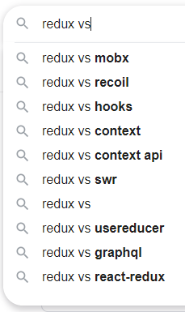

## Redux란?

리덕스는 리액트에서 가장 많이 사용되는 상태 관리 라이브러리중 하나이다. 리덕스를 사용하면 컴포넌트의 상태 업데이트 관련 로직을 다른 파일로 분리시켜서 효율적으로 관리할 수 있다. 최근 [Redux Toolkit](https://redux-toolkit.js.org/)이 등장하면서 더욱 더 이 효율성은 빛을 보이고 있다.

이번 포스팅에서는 Redux Toolkit보다는 Redux에 집중해 좀 더 자세하게 Redux를 파헤쳐 보려고 한다.

## Redux 기본 용어

리덕스에 대해 기본적으로 알아야할 개념들을 먼저 숙지해보자.

1. **액션(Action)**

   상태에 변화가 필요하다면 액션을 일으켜야한다. 액션은 객체로 표현되며 type필드를 반드시 가지고 있어야 한다.

   ```js
   {
       type: 'ADD_TODO',
       data: {
           id: 1,
           text: '리덕스 배우기'
       }
   }
   ```

2. **액션 생성함수(Action Creator)**

   액션 생성함수는 액션 객체를 만들어주는 함수이다. 화살표 함수로도 표현이 가능하다.

   ```js
   function addTodo(data) {
     return {
       type: 'ADD_TODO',
       data,
     }
   }
   ```

3. **리듀서(reducer)**

   리듀서를 한국어로 번역해보면 변화를 일으키는 것을 말한다. 리듀서는 현재 상태와 액션 객체를 받아, 필요하다면 새로운 상태를 리턴하는 함수이다. 액션 유형을 기반으로 이벤트를 처리하는 이벤트 리스너라고 생각하면 된다.

   ```js
   const initialState = {
     counter: 1,
   }
   function reducer(state = initialState, action) {
     switch (action.type) {
       case INCREMENT:
         return {
           counter: state.counter + 1,
         }
       default:
         return state
     }
   }
   ```

4. **스토어(Store)**

   스토어에는 상태가 들어있다. 하나의 프로젝트는 하나의 스토어만 가질 수 있다.

5. **디스패치(Dispatch)**

   스토어의 내장 함수 중 하나인 디스패치는 액션 객체를 넘겨줘서 상태를 업데이트 하는 유일한 방법이다. 이벤트 트리거라고 생각할 수 있다.

6. **구독(Subscribe)**

   스토어의 내장 함수 중 하나인 구독은 리스너 함수를 파라미터로 넣어 호출하면 상태가 업데이트될 때마다 호출된다. 일종의 이벤트 리스너라고 볼 수 있다.

   ```js
   const listener = () => {
     console.log('상태가 업데이트됨')
   }
   const unsubscribe = store.subsribe(listener)

   unsubscribe() // 추후 구독을 비활성화할 때 함수를 호출
   ```

7. **셀렉터(Selector)**

   일반적인 vanilla.js의 리덕스에서는 스토어의 내장함수인 getState를 사용하지만 react-redux에서는 상태 값을 가져올 때 사용한다.

## 리덕스 상태 변화의 흐름

리덕스 공식 문서에서 제공하는 gif를 보며 위에서 말한 용어로 흐름을 익혀보자.


- 초기 상태

  - 먼저 root reducer 함수를 사용하여 만들어진 리덕스 스토어가 있다.
  - 스토어는 root reducer를 한번 호출하고 리턴 값을 초기 상태로 저장한다.
  - UI가 처음 렌더링될 때, UI 컴포넌트는 리덕스 스토어의 상태에 접근하여 그것을 렌더링에 활용한다. 또한 그것들은 후에 상태의 변화가 업데이트 되는 것을 구독한다.

- 업데이트(순서)
  1. 유저가 버튼을 클릭한다.
  2. 앱은 유저의 행동에 맞는 디스패치를 실행해 액션을 일으킨다.
  3. 스토어는 이전 상태와 현재 액션으로 리듀서 함수를 실행하고, 그 리턴 값을 새로운 상태로 저장한다.
  4. 스토어는 스토어를 구독하고 있던 UI들에게 업데이트 되었다고 알려준다.
  5. 스토어의 데이터가 필요한 각각의 UI들은 필요한 상태가 업데이트 되었는지 확인한다.
  6. 데이터가 변경된 각 구성요소는 새 데이터로 강제로 다시 렌더링하므로 화면에 표시되는 내용을 업데이트 할 수 있다.

## Redux의 세가지 원칙

1. **Single source of truth**

   하나의 애플리케이션 안에는 하나의 스토어만 사용하자는 원칙이다.
   이렇게 하면 애플리케이션의 디버깅이 쉬워지고 서버와의 직렬화가 될 수 있고 쉽게 클라이언트에서 데이터를 받아들여올 수 있게 된다.

2. **State is read-only**

   상태를 변화시키는 방법은 오직 액션을 일으키는 것이다.
   이것은 상태를 변화시키는 의도를 정확하게 표현할 수 있고, 상태 변경에 대한 추적이 용이해지게 된다.

3. **Changes are made with pure functions**

   변화를 일으키는 리듀서 함순느 순수한 함수여야 한다. 순수 함수는 다음과 같은 조건을 만족한다.

   - 리듀서 함수는 이전 상태와 액션 객체를 파라미터로 받는다.
   - 파라미터 외의 값에는 의존하면 안된다.
   - 이전 상태는 절대로 건드리지 않고, 변화를 준 새로운 상태 객체를 만들어서 반환한다.
   - 똑같은 파라미터로 호출된 리듀서 함수는 언제나 똑같은 결과 값을 반환해야 한다.

## 바닐라 자바스크립트에서의 Redux 사용법

설치 방법

```shell
npm install redux
```

코드

```js
import { createStore } from 'redux'

/**
 * 리듀서
 * 리듀서의 함수 시그니쳐는 : (state, action) => newState
 *
 * 리덕스 상태는 오직 js 객체, 배열, 원시값만 포함해야한다.
 * 루트 상태 값은 보통 객체이다.
 * 만약 상태가 변화한다면 새로운 객체를 리턴해야 한다.
 *
 * 리듀서에 원하는 조건부 로직을 사용할 수 있다.
 * 이 예에서 우리는 switch를 사용하지만 필수는 아니다.
 */
function counterReducer(state = { value: 0 }, action) {
  switch (action.type) {
    case 'counter/incremented':
      return { value: state.value + 1 }
    case 'counter/decremented':
      return { value: state.value - 1 }
    default:
      return state
  }
}

// 리덕스 스토어 생성
let store = createStore(counterReducer)

// 스토어 상태 구독 (상태가 바뀔때마다 상태를 출력함)
store.subscribe(() => console.log(store.getState()))

// 내부 상태를 변화시키는 유일한 방법 dispatch
store.dispatch({ type: 'counter/incremented' })
// {value: 1}
store.dispatch({ type: 'counter/incremented' })
// {value: 2}
store.dispatch({ type: 'counter/decremented' })
// {value: 1}
```

## 리액트에서의 Redux 사용법

- [리액트 리덕스 예제 코드](https://stackblitz.com/edit/react-todo-counter-kyun?embed=1&file=src/containers/TodosContainer.js)

위의 코드는 todo 리스트와 기본적인 카운터 예제를 합쳐놓은 코드이다. velopert님이 쓰신 리액트를 다루는 기술의 예제 코드를 stack blitz에 정리해 보았다.

필요 패키지는 다음과 같다.

- [redux](https://github.com/reduxjs/redux)
- [react-redux](https://github.com/reduxjs/react-redux)

선택 패키지는 아래와 같다. 코드 구조를 좀더 짧고 가독성을 좋게 해주는 특징이 있다.

- [redux-actions](https://github.com/redux-utilities/redux-actions)
- [immer](https://github.com/immerjs/immer)

위 코드의 대략적인 흐름은 다음과 같다.

1. modules 폴더에는 액션 타입과 액션 생성함수, 리듀서를 한 파일에 모아놓았다. index.js에 rootReducer로 두개의 리듀서를 합쳐주었다.
2. index.js 파일에서는 스토어를 생성해 react-redux가 제공하는 Provider로 App을 감싸고 store인수에 store를 넣어주었다.
3. 컨테이너에는 react-redux가 제공하는 useSelector와 useDispatch를 사용하여 dispatch를 실행하거나 상태를 가져와 자식들에게 뿌려주었다. (최근에는 컨테이너를 쓰는 패턴은 권장하지 않는다고 함 - [Dan Abramov 트윗](https://twitter.com/dan_abramov/status/1056158199877943297))
4. 마지막으로, useActions를 따로만들어 한 컴포넌트에 여러개의 dispatch를 가독성 좋게 쓸 수 있도록 정의하였다.

## Redux의 대체품?



리덕스 vs를 검색하면 위와 같은 키워드들이 등장한다.

이중 대표적인 상태관리 라이브러리는 mobx, recoil이 있다. 또한 react에서 자체 제공하는 context api도 존재한다. 시간이 나면 이 라이브러리들도 비교해보면서 어떠한 차이가 있는지 포스팅해보도록 하겠다. 지금은 이러한 대체품들이 있다는 것만 알고 넘어가도록 하려고 한다.

## 리덕스는 언제 쓰는게 좋을까?

그렇다면 리덕스는 언제 쓰는게 좋을까? 이 질문에 대한 답은 [리덕스의 공식문서](https://redux.js.org/faq/general#when-should-i-use-redux)에 나와있다.

- 앱의 여러 위치에서 필요한 많은 양의 상태들이 존재할 때 (전역 상태가 필요하다고 느껴질 때)
- 상태들이 자주 업데이트 될 때
- 상태를 업데이트 하는 로직이 복잡할 때
- 앱이 중간 또는 큰 사이즈의 코드를 갖고 있고 많은 사람들에 의해 코드가 관리될 때
- 상태가 업데이트되는 시점을 관찰할 필요가 있을 때

## 더 알아볼 것

리덕스 비동기를 지원하는 [Redux Thunk](https://github.com/reduxjs/redux-thunk) 와 [Redux Saga](https://github.com/redux-saga/redux-saga) 그리고 다양한 미들웨어들이 존재한다.

마지막으로, 사실 이 글을 쓰게 된 이유이기도 한데 리덕스 진영에 [리덕스 툴킷](https://github.com/reduxjs/redux-toolkit)이 나오면서, 코드들이 많이 간소화 되었고 생산성도 향상되게 되었다. 다음 글에서는 이 리덕스 툴킷 사용법에 대해서 파헤쳐 볼까 한다.

## 참고

- [Redux 공식 문서](https://redux.js.org/)
- [리액트를 다루는 기술](http://www.kyobobook.co.kr/product/detailViewKor.laf?mallGb=KOR&ejkGb=KOR&barcode=9791160508796)
