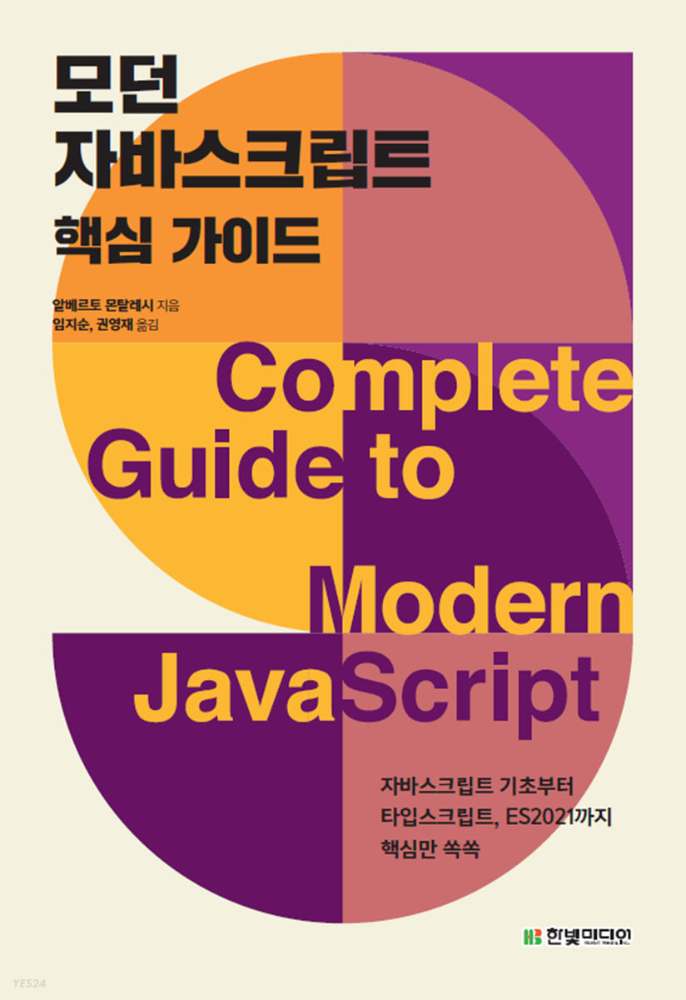

## 리뷰를 시작하기 앞서

이 리뷰는 한빛미디어 도서 서평단으로 책을 제공 받아 리뷰를 쓰는 글임을 알립니다.

## 책 소개

이 책은 es6(es2015) 부터 es2021까지의 문법을 소개해놓은 책이다. 기존의 모던 자바스크립트의 문법에 궁금증을 갖고 있었거나 정리되어 있는 책이 필요하다고 생각된다면 구매해볼만한 책이라고 생각된다.

## 목차

목차는 크게 23개의 챕터로 되어 있는데 자바스크립트의 기초부터 최신 문법까지 차례로 다루고 있다.

그동안 쓰고 있지 않던 문법이나 알지 못했던 최신 문법이 차례대로 정리가 되어 있어서 두고두고 보기에 아주 좋은 책이다.

## 책의 장점

이 책은 보면서 자신이 잘 해가고 있는지 점검할 수 있도록 퀴즈를 제공한다. 퀴즈를 풀면서 다시한번 해당 챕터의 내용을 점검해볼 수 있다. 또한 책이 나름 조그만 편이라 들고다니면서 잠깐씩 참고하기에도 매우 좋은 책인 것 같다는 생각을 했다. 평소에 자바스크립트를 주언어로 사용하고 있는데 이번 기회에 이 책을 읽으면서 다시한번 최신 문법들을 되짚어 볼 수 있었던 계기가 되었던 것 같다.

## 추천 독자

이 책은 자바스크립트의 최신 문법들을 하나의 정리된 책으로 읽거나 소장하고 싶은 사람들에게 강력하게 추천하는 바이다. 또는, 자바스크립트 최신 문법을 다시 한번 복습하고 싶은 사람들에게도 추천한다.
