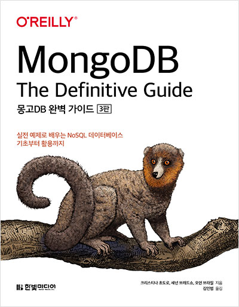

## 리뷰를 시작하기 앞서

이 리뷰는 한빛미디어 도서 서평단으로 책을 제공 받아 리뷰를 쓰는 글임을 알립니다.

## 책 소개

이 책은 몽고 DB 에 관련된 가이드가 들어있는 책이다. [공식 가이드](https://docs.mongodb.com/guides/)만 봤을 때 영어로 되있어서 영어가 익숙하지 않은 사람들에게는 익히기가 어렵겠다는 생각도 하여서 마침 이런 책이 나와 몽고db를 본격적으로 사용하는 사람에게 유용한 책이겠다라는 생각이 들었다.

제목 그대로 이 책은 몽고db에 대한 완벽 가이드라고 볼 수 있다. 내가 생각하는 이 책의 대상 독자는 `몽고db에 대해 한번 사용해봤는데 좀 더 자세하게 사용 방법과 원리를 알고 싶은 사람`이라고 생각한다.

## 목차

목차는 크게 6부분으로 나뉘는데 다음과 같다.

- 몽고DB 시작
- 몽고DB 개발
- 복제
- 샤딩
- 애플리케이션 관리
- 서버 관리

목차만 봐도 몽고db에 대해 얼마나 자세하게 다룰 수 있는지를 알 수 있었다.

## 내용

처음 책을 읽었을 때는 몽고db의 소개와 기본 개념들이 잘 나와 있어서 몽고 db의 기본 개념이 잘 들어 있다는 느낌을 받았다. 하지만 뒤로 갈수록 내용이 나에게는 어렵게 느껴졌고 기능에 대한 체감이 잘 되지 않았다. 물론 실습이 있어서 하나하나 해보면서 하기엔 정말 좋은 책인듯 하다.

내가 생각하는 이 책의 사용법은 몽고 db를 개발하면서 모르는 부분이 있으면 찾는 용도로 사용하는 일종의 참고서 역할이 적당하다고 느꼈다. 실습을 하나하나 다 해보면서 책을 진행하기에는 너무 많은 시간이 소요되어 책에 대한 흥미를 잃을 수도 있지 않을까 싶다.

## 후기

읽고 나니까 확실히 몽고db에 대한 자세한 정보들을 확인할 수 있었고 실습들이 들어있어서 직접 따라해보며 기능과 명령어를 익히기에 좋다고 느꼈다. 단, 종종 처음 보는 개발 용어들도 봐서 미리 데이터베이스에 대한 선행 지식이 어느정도 필요하다고 생각했다.

이런 부분에서 항상 오레일리 책들이 상당히 전문적이기 때문에 발생하는 장점이자 단점이라고 생각했다. 기술이 어느정도 익숙한 사람에겐 쉬울 수 있겠지만 초급자용이 아니다 보니 기술 언어에 대한 각주 같은 것들이 있었으면 조금 더 좋지 않았을까 싶다.

마지막으로 책을 살지 말지 고민하여 이 글을 접하게 되었다면 `어느정도 db에 대한 지식과 관계형 db정도는 써본 사람들에게 이 책을 권하고 싶다.` 반면, db에 대한 선행 지식이 없거나 관계형 db등을 써보지 않은 사람들에게는 먼저 db책을 하나 보는 것을 권하고 싶다.
