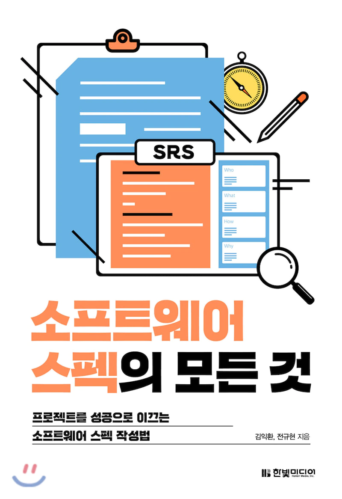

## 리뷰를 시작하기 앞서

운좋게 한빛미디어 도서 서평단에 선정이 되서 책을 리뷰할 수 있는 좋은 기회가 찾아왔다.🚀

나는 주니어 개발자임을 앞서 알리고, 책을 읽은 시점이 주니어 개발자의 시점이라고 봐주셨으면 좋겠다.

## 책의 목차

이 책은 크게 두 부분으로 나뉜다. 1부에서는 `소프트웨어 스펙이란?` 이라는 주제를 다루고, 2부에서는 스펙이라고도 하는 `SRS 작성법`에 대해 다룬다.

## 책 소개

나는 책을 읽기 전 스펙 작성이 그렇게 중요한가? 라는 생각을 항상 갖고 있었다. 학교 프로젝트를 할 때 나는 항상 스펙을 간단히 적거나 혹은 아예 적지 않고 바로 개발에 들어가곤 했었다. 하지만 이 책을 읽고나서 그러한 생각들이 아예 싹 사라졌다. 이 책은 나의 그러한 생각을 바꿀 수 있게 스펙을 써야하는 이유와 스펙을 안쓰거나 대충 작성할 경우에 일어날 수 있는 일들을 사례를 하나하나 들어가며 친절하게 설명해준다.
또한, 스펙에 대해 `Who, What, How` 세가지 키워드로 분리하여 스펙은 어떻게 써야 제대로 잘 쓸 수 있는지를 알려주는 지침서가 되주기도 한다.

마지막 2부에서는 실제로 SRS 즉, 스펙 문서 작성법을 어떻게 작성하는지 목차부터 시작해 자세한 예시를 들어서 설명해 주는 책이기도 하다.

나는 이 책을 읽고나서 `스펙을 왜써야 하는지, 스펙을 어떻게 써야하는지, 스펙을 쓰는 이유가 무엇인지`에 알게되었고 앞으로 스펙문서를 쓰면서 항상 참고를 해볼만한 좋은 지침서가 하나 나온 것 같다.

이 책을 살지말지 고민하거나, 나처럼 위와 같은 고민들을 갖고 있다면 이 책에서 정답을 찾을 수 있을 것 같다.

주니어 개발자라면 대략적인 스펙 문서의 흐름을 터득하기에 좋을 것 같고, 시니어 개발자라면 스펙 문서의 교과서 같은 책이 아닐까 싶다.

이 책의 머리말 중 가장 멋있던 말을 하나 남기며 소개를 끝낼까 한다.

> "소프트웨어 개발에 있어서 가장 어려운 일은 개발 자체가 아니라 무엇을 개발할지 결정하는 일이다"
>
> -프레드릭 브룩스-

## 마치며

책을 읽으며 소프트웨어 개발이 단순히 개발 능력이 중요한 것이 아니라 설계하는 것이 얼마나 중요한지 깨닫게 되었다.

앞으로 이 책을 참고하며 개발을 할 때 스펙을 작성하는 법을 천천히 터득해가는 것도 좋은 경험이 될 것 같다.😀

만약, 스펙에 관해 어떻게 써야할지를 몰라 인터넷을 돌아다니다가 이 글을 보게 된다면 과감하게 `소프트웨어 스펙의 모든 것`을 추천하고 싶다.
