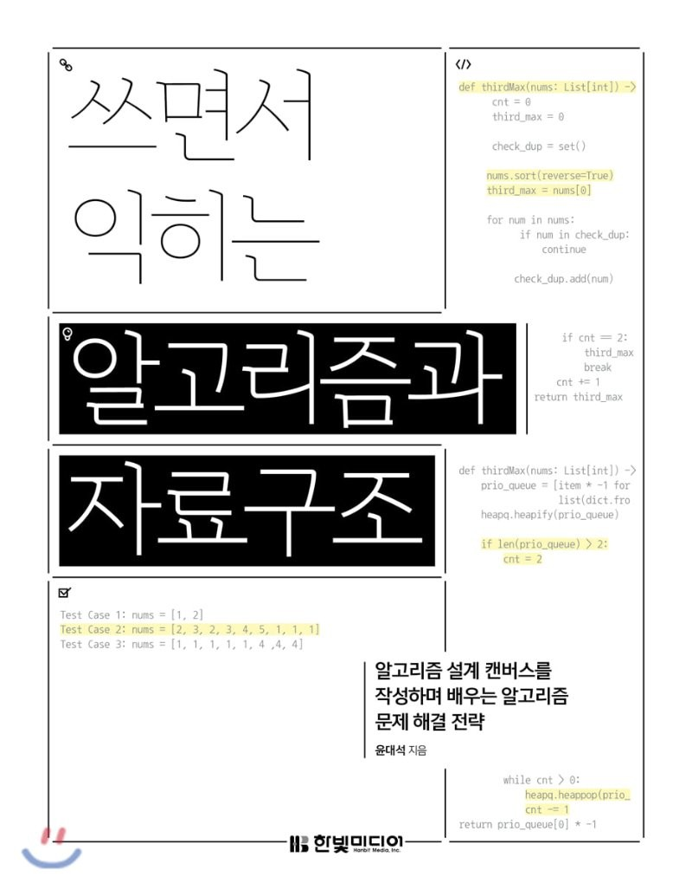

## 리뷰를 시작하기 앞서

이 리뷰는 한빛미디어 도서 서평단으로 책을 받아 리뷰를 쓰는 글임을 알립니다.

## 목차

목차는 일반 알고리즘 책과 비슷하게 다양한 자료구조와 알고리즘 순서로 되어있다.

기본적인 자료구조인 배열, 연결리스트, 스택, 큐부터 알고리즘 문제로 자주 등장하는 문자열, 다이나믹 프로그래밍 등이 수록되어 있다.

## 이 책의 특징

이 책은 일반적인 코딩테스트를 준비하기 위해서가 아닌 알고리즘의 생각법과 접근법을 제시해준다. 이 책만의 장점이라고도 할 수 있는 `노트 레이아웃`을 사용해 문제의 아이디어를 제시하고, 시간복잡도와 공간복잡도를 생각하며 문제를 풀 수 있게끔 자연스럽게 유도해준다. 그러한 점에 있어서 일반적인 코딩테스트 뿐만 아니라 면접에서 접할 수 있는 알고리즘 `손 코딩`에도 대비할 수 있게 된다.

문제는 외국에서 가장 유명한 사이트 중 하나인 `릿코드 문제`를 활용하는데, 문제들을 릿코드에 들어가서 직접 풀어볼 수도 있다.

최근 가장 많이 사용되는 코딩테스트 언어 중 하나인 `파이썬`을 사용한다는 것도 이 책의 장점이라고 볼 수 있다.

마지막으로, 알고리즘 노트 방법을 위한 사이트 추천과, 알고리즘 학습을 위한 사이트 소개로 마무리가 되는데 이 사이트 또한 알고리즘을 풀면서 유용하게 참고할 수 있어 책을 다 읽고 난 뒤에도 추가적인 학습을 유도하고 있다.

## 추천 독자

개인적으로 파이썬을 사용하며 코딩테스트를 준비하는 사람이고, 또한 손코딩 시험을 볼 수도 있는 면접이 두려운 사람이라면 한번쯤 읽어보고 방법을 터득하면 좋을 것 같다. 이 책에 나와있는 노트 레이아웃 방법을 손코딩 시험에서 활용하면 좋을 것 같다는 생각을 했다.

## 마치며

한빛미디어에서 파이썬 알고리즘 책으로 유명한 나동빈님의 이것이 코딩테스트다 책과 더불어 이 책도 알고리즘을 익히기에 정말 좋은 책이라고 생각을 했다. 이것이 코딩테스트다 책을 다 읽고 무엇을 풀지 고민하는 사람이 있다면 과감하게 이 책을 보며 릿코드를 풀어보기를 적극 추천한다!
