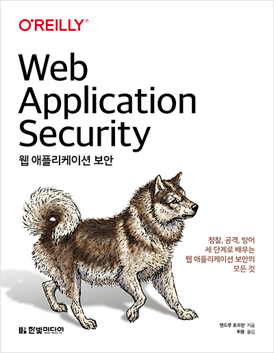

## 리뷰를 시작하기 앞서

이 리뷰는 한빛미디어 도서 서평단으로 책을 받아 리뷰를 쓰는 글임을 알립니다.

## 목차

이 책은 크게 세가지의 파트로 나뉘어진다. 정찰, 공격, 보안인데 정찰에서는 웹 애플리케이션 정보를 찾는 방법을 소개한다. 공격에서는 해커들이 쓰는 공격 방식을 다루고, 방어에서는 이러한 공격들을 어떻게 해야 방어할 수 있는지를 다룬다.

## 내가 생각하는 대상 독자

보안이라고 해서 보안관련 직종의 사람들만 읽을 수 있는 어려운 글일까 싶었지만 막상 까보니 그게 아니었다. 이 책에서는 **대상 독자를 웹 프로그래밍 배경을 갖춘 개발자나 관리자도 쉽게 읽을 수 있다고 명시하고 있다.** 실제로 책을 읽으니 웹 개발자라면 이해할 수 있을만한 쉬운 언어와 말로 내용을 전달해준다. 만약 어떤 공격 유형이 있는지 궁금하거나 이러한 공격 유형을 막는 방법이 무엇인지 간단하게 알고 싶은 웹 개발자라면 이 책을 적극 추천한다! 아마 원하는 정보를 많이 얻어갈 수 있을 것 같다.

## 줄거리

처음에는 보안의 역사에 대해 설명하며 어떻게 소프트웨어의 보안이 진화하게 되었는지 다룬다. 이를 통해 좀더 보안에 쉽게 접근할 수 있게 된다. 그 후에는 본격적으로 `정찰` 파트를 통해 보통 해커들은 웹 보안 취약점을 탐색하기 위해 어떻게 정찰하는지를 설명한다. 물론 깊게 들어가지는 않지만 정찰의 방법을 아는 것만으로도 웹 보안에 대해 좀 더 친숙하게 다가갈 수 있다. 자연스럽게 웹 보안에 다가가게 되면 본격적으로 해커들이 `공격`하는 방법에 대해 다룬다. 이를 통해 얼마나 많은 취약점들이 존재하는지 깨달을 수 있다. 또한 그에대한 위험성 또한 느껴지기도 한다. 마지막으로는 `방어` 방법을 설명하며 웹 보안을 방어하기 위해 어떤 방법들을 써야하는지를 설명한다.

## 마치며

평소에 XSS, CSRF, 인젝션등의 보안 언어들을 많이 알고는 있었지만 이러한 공격방법이나 방어 방법을 제대로 알고있지 못하였다. 하지만 이 책을 통해 그러한 궁금증을 모두 해결하고 있었고 더 많은 보안 취약점들에 대해서도 알게되었다. 이를 통해 조금이나마 보안쪽에 안목이 넓어질 수 있었다. 만약 이 책을 살지말지 고민하고 있는데 이 글을 보게된다면! 만약 당신이 나처럼 `보안에대해 잘 알지는 못하지만 보안에 대해 조금이라도 알고 싶고 궁금하다면 이 책을 적극 추천드리고 싶다!` 조금이나마 보안에 대해 넓은 시각을 갖게 될 것이다.
