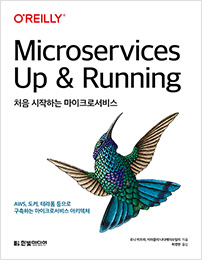

## 리뷰를 시작하기 앞서

이 리뷰는 한빛미디어 도서 서평단으로 책을 받아 리뷰를 쓰는 글임을 알립니다.

## 목차

이 책의 목차는 다음과 같다.

1. 마이크로서비스 아키텍처로의 여정
2. 마이크로서비스 운영 모델 설계
3. 마이크로 서비스 설계: SEED 프로세스
4. 마이크로서비스의 크기 조정
5. 데이터 처리
6. 인프라 파이프라인 구축
7. 마이크로서비스 인프라 구축
8. 개발자 워크스페이스
9. 마이크로서비스 개발
10. 마이크로서비스 릴리스
11. 변경 관리
12. 여정의 끝(그리고 새로운 시작)

## 책 소개

이 책은 개발자라면 누구나 들어봤을 법한 마이크로 서비스에 대해 소개한다. 마이크로 서비스가 어떠한 서비스인지, 어떤 방식으로 설계를 할 수 있는지 구체적인 예시를 들며 마이크로 서비스 설계에 대한 것을 처음 부터 끝까지 소개해주는 책이다.

재미있었던 부분은 운영 모델을 설계할 때 어떤 팀을 만들어가야하는지, 팀 역량과 팀 규모등을 고려하며 서비스 단계를 설계하는 부분이었다. 마이크로 서비스 설계 부분에서 DDD(도메인 주도 설계) 부분도 매우 흥미로웠다. 예제는 도커, 레디스, 테라폼, kubectl, 헬름, argo 등을 예시로 보여주어 데브옵스를 경험해보지 않은 개발자들에겐 어려울 수 있을 것 같았다. 하지만, 이 책은 마이크로 서비스를 완전하게 구현하는 목적을 가진 책이 아니다. 마이크로 서비스라는 용어 자체가 상세한 기술이라기 보다는 추상적 단위의 아키텍쳐라고 볼 수도 있기에 마이크로서비스에 대한 감을 찾는다고 보거나, 어떤 하나의 키워드에 대해 깨우침을 얻을 수 있는 책으로 본다면 상당히 읽어볼만한 책이라고 생각이 된다. 책 마지막에서도 마이크로 서비스 아키텍쳐를 단순한 목적지가 아니라 여정이라는 것을 강조했다. 이 여정에는 과정이 가장 중요하다고 하였다. 그러한 과정을 따라가보는 책이라고 보면 좋을 것 같다.

## 읽고나서 마이크로서비스에 대한 생각

마이크로서비스를 채택하기 위해서는 팀의 기술 숙련도가 상당히 중요하다고 생각하게 되었다. 마이크로 서비스를 채택하였을 때 코드가 분리되어 의존성을 줄여 버그를 줄이거나 구현의 용이함을 가져올 수는 있겠지만, 이는 단순히 공짜로 가져오는 것이 아니라 초기의 번거로운 세팅의 복잡성을 늘리는 것과 바꾼다는 점이 있었다.
따라서, 팀에서 마이크로서비스를 채택할 때는 단순히 이 용어가 멋있어서 또는 다들 쓰니까 우리도 써보자가 아니라 팀이 어떠한 기술 숙련도를 갖고 있고, 마이크로 서비스를 설계할만한 준비가 되어있는지를 곰곰히 따져봐야겠다는 생각을 하게 되었다. 또한, 내가 몸담고 있는 프론트엔드 세계에서는 어떻게 마이크로서비스를 생각하고 있을까가 궁금했는데 마침 FECONF 발표에서 TONY님이 발표하신 영상이 있어서 이 동영상을 링크걸어 놓고 글을 마칠까 한다.

만약, 마이크로서비스가 무엇인지 궁금하다면 한번쯤은 이 책을 보는 것도 재미있을 것 같다!

<iframe width="560" height="315" src="https://www.youtube-nocookie.com/embed/FQoNY2W0s4E" title="YouTube video player" frameborder="0" allow="accelerometer; autoplay; clipboard-write; encrypted-media; gyroscope; picture-in-picture" allowfullscreen></iframe>

## 참고

- [처음 시작하는 마이크로서비스](http://www.yes24.com/Product/Goods/102805240)
- [원지혁 - 프론트엔드에서의 마이크로 서비스 아카텍처](https://www.youtube.com/watch?v=FQoNY2W0s4E)
