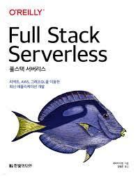

## 리뷰를 시작하기 앞서

이 리뷰는 한빛미디어 도서 서평단으로 책을 받아 리뷰를 쓰는 글임을 알립니다.

## 목차

목차는 다음과 같다.

1. 서버리스 컴퓨팅 시대의 풀스택 개발
2. AWS Amplify 시작하기
3. 첫 번째 애플리케이션 만들기
4. 인증 소개
5. 사용자 정의 인증 전략
6. 서버리스 함수 심화 1
7. 서버리스 함수 심화 2
8. AWS AppSync 심화
9. Amplify DataStore를 이용한 오프라인 애플리케이션 구축
10. 이미지와 스토리지 작업
11. 호스팅 : CI/CD를 이용한 애플리케이션 배포

## 줄거리

글의 내용은 제목과 같이 풀스택을 서버리스로 구현하는 일련의 과정들을 담고 있다.

이 중 기술은 AWS Amplify를 사용하여 리액트, Graph QL, AWS lambda, Cognito, Amplify DataStore, S3등을 이용한다.

첫 장에서는 서버리스 컴퓨팅을 이용한 풀스택 개발의 장점을 소개하며 왜 이러한 방식이 등장하게 되었는지 장점은 무엇인지에 대해 소개한다.

내가 간략하게 이 부분에 대해 메모해보고자 한다면 확장성, 비용, 개발 속도, 실험, 보안과 안정성, 적은 코드 등등의 장점이 있다고 한다. 빠르게 배포를 하고 싶은 상황이 생긴다면 이러한 기술들을 적용하면 좋을 것 같아 보였다. 하지만 이 책의 단점은 AWS Amplify에 익숙하지 않은 사람들은 조금은 어렵게 접할 수 있겠다 라는 생각을 했다.

## 내가 생각하는 대상 독자

책에서는 대상 독자를 클라우드 컴퓨팅에 관심이 있는 풀스택 애플리케이션을 구축하려는 모든 엔지니어를 대상이라고 하고 있다. 나도 이책을 읽고나서 별도의 서버없이 어떻게 코드를 짜는지 일련의 과정을 배울 수 있었고 나처럼 이러한 서버리스 풀스택 개발에 관심이 있는 개발자라면 가볍게 읽어보며 기술의 흐름을 익히는데 상당히 좋은 책이라고 생각했다.

## 마치며

최근 클라우드 컴퓨팅의 발전이 급속도로 늘어나면서 신기술들이 등장하는 상황에 어떻게 서버가 없이 api 함수만을 짜서 애플리케이션과 연동하는지 궁금한 부분들이 많았는데 이 책을 통해 많은 궁금증을 해소할 수 있던 시간이 되었던 것 같다. 책 페이지도 200페이지 밖에 되지않아 시간 소요도 얼마 걸리지 않아서 가볍게 읽기 좋은 책이었다. 나처럼 이런 궁금증이 마음 속에 내재되어 있거나 이름이 뭔가 거창하고 멋진 풀스택 서버리스라는 기술에 관심이 있다면 한 번 읽어보는 것을 강력 추천한다!
